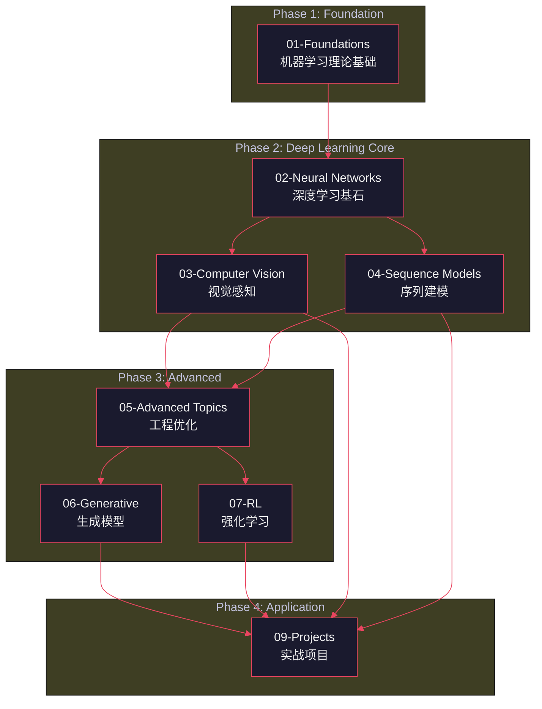

<div align="center">


<br/>

<!-- Technical Badges -->
<p>


</p>

<p>
<a href="https://zimingttkx.github.io/AI-Practices/"></a>
<a href="./README_EN.md"></a>
</p>

</div>

---

## Abstract

**AI-Practices** 是一个系统化的人工智能学习与研究平台，采用 **渐进式学习框架 (Progressive Learning Framework, PLF)** 方法论，构建了从经典机器学习到前沿深度学习的完整知识体系。本项目涵盖 **113+ 可复现实验**、**9 个核心模块** 和 **19 个端到端项目**，包括多个 **Kaggle 竞赛金牌方案**。项目遵循软件工程最佳实践，代码总量超过 **149,000 行**，全部符合 PEP8 规范。

**关键词**: 机器学习, 深度学习, 计算机视觉, 自然语言处理, 强化学习, 生成式模型

---

## Table of Contents

- [1. Introduction](#1-introduction)
- [2. Methodology](#2-methodology)
- [3. System Architecture](#3-system-architecture)
- [4. Modules Overview](#4-modules-overview)
- [5. Experimental Setup](#5-experimental-setup)
- [6. Results & Benchmarks](#6-results--benchmarks)
- [7. Quick Start](#7-quick-start)
- [8. Citation](#8-citation)
- [9. License](#9-license)

---

## 1. Introduction

### 1.1 Research Background

随着人工智能技术的快速发展，构建一个系统化、可复现的学习平台变得至关重要。现有学习资源往往存在以下问题：

| 问题 | 描述 |
|:-----|:-----|
| **碎片化** | 知识点分散，缺乏系统性 |
| **理论实践脱节** | 理论讲解与代码实现分离 |
| **可复现性差** | 缺乏完整的实验环境配置 |
| **工程化不足** | 忽视软件工程最佳实践 |

### 1.2 Objectives

本项目旨在提供一个 **理论驱动、实践为本、工程导向** 的 AI 学习平台：

```
┌─────────────────────────────────────────────────────────────────┐
│                         AI-Practices                             │
├─────────────────────────────────────────────────────────────────┤
│  ◆ 113+ Reproducible Experiments                                │
│  ◆ 9 Core Learning Modules                                      │
│  ◆ 19 End-to-End Projects                                       │
│  ◆ 149,000+ Lines of Production-Quality Code                    │
│  ◆ Multiple Kaggle Gold Medal Solutions                         │
└─────────────────────────────────────────────────────────────────┘
```

### 1.3 Contributions

本项目的主要贡献包括：

1. **渐进式学习框架 (PLF)**: 提出四阶段学习方法论，实现从理论到实践的平滑过渡
2. **模块化课程体系**: 设计 9 个相互关联的学习模块，覆盖 AI 核心技术栈
3. **可复现实验集**: 提供 113+ 个完整的 Jupyter 实验，含详细注释
4. **工程化项目模板**: 建立标准化的项目结构和代码规范
5. **竞赛级解决方案**: 包含多个 Kaggle Top 1% 金牌方案

---

## 2. Methodology

### 2.1 Progressive Learning Framework (PLF)

本项目采用四阶段渐进式学习框架：

```
                    ┌─────────────────────────────────────┐
                    │     Progressive Learning Framework   │
                    └─────────────────────────────────────┘
                                      │
        ┌─────────────┬───────────────┼───────────────┬─────────────┐
        ▼             ▼               ▼               ▼             ▼
   ┌─────────┐  ┌─────────┐    ┌─────────┐    ┌─────────┐    ┌─────────┐
   │ Theory  │  │  Impl   │    │Framework│    │Practice │    │  Eval   │
   │  First  │─▶│  From   │───▶│ Master  │───▶│ Project │───▶│  Kaggle │
   │         │  │ Scratch │    │         │    │         │    │         │
   └─────────┘  └─────────┘    └─────────┘    └─────────┘    └─────────┘
       │             │              │              │              │
       ▼             ▼              ▼              ▼              ▼
   数学原理      核心算法       TensorFlow      端到端项目      竞赛验证
   算法理论      底层实现       PyTorch         真实场景        排名指标
```

### 2.2 Learning Principles

| Phase | 原则 | 方法 | 产出 |
|:-----:|:-----|:-----|:-----|
| **Ⅰ** | Theory First | 数学推导 + 算法分析 | 理论笔记 |
| **Ⅱ** | Implementation | NumPy 从零实现 | 核心代码 |
| **Ⅲ** | Framework | TensorFlow/PyTorch | 工程代码 |
| **Ⅳ** | Practice | 真实项目 + 竞赛 | 完整方案 |

---

## 3. System Architecture

### 3.1 Module Dependencies



### 3.2 Directory Structure

```
AI-Practices/
│
├── 01-foundations/                 # 机器学习基础理论
│   ├── training-models/            #   优化方法: SGD, Adam, L-BFGS
│   ├── classification/             #   分类算法: LR, SVM, Decision Tree
│   ├── ensemble-learning/          #   集成方法: Bagging, Boosting, Stacking
│   └── unsupervised-learning/      #   无监督: Clustering, Dimensionality Reduction
│
├── 02-neural-networks/             # 神经网络与深度学习
│   ├── keras-introduction/         #   框架入门: Sequential, Functional API
│   ├── training-deep-networks/     #   训练技巧: BatchNorm, Dropout, Residual
│   └── custom-models/              #   自定义: Layer, Loss, Training Loop
│
├── 03-computer-vision/             # 计算机视觉
│   ├── cnn-architectures/          #   架构演进: LeNet → ResNet → EfficientNet
│   ├── transfer-learning/          #   迁移学习: Feature Extraction, Fine-tuning
│   └── model-interpretability/     #   可解释性: Grad-CAM, SHAP
│
├── 04-sequence-models/             # 序列模型与NLP
│   ├── rnn-lstm-gru/               #   循环网络: Vanishing Gradient, Gating
│   ├── attention-transformer/      #   注意力机制: Self-Attention, Multi-Head
│   └── pretrained-models/          #   预训练: BERT, GPT, T5
│
├── 05-advanced-topics/             # 高级专题
│   ├── hyperparameter-tuning/      #   超参优化: Optuna, Ray Tune
│   ├── distributed-training/       #   分布式: Data Parallel, Model Parallel
│   └── model-deployment/           #   部署: TensorRT, ONNX, TFLite
│
├── 06-generative-models/           # 生成式模型
│   ├── variational-autoencoders/   #   VAE: Latent Space, Reparameterization
│   ├── generative-adversarial/     #   GAN: DCGAN, WGAN, StyleGAN
│   └── diffusion-models/           #   扩散: DDPM, Stable Diffusion
│
├── 07-reinforcement-learning/      # 强化学习
│   ├── value-based/                #   值方法: Q-Learning, DQN, Double DQN
│   ├── policy-based/               #   策略方法: REINFORCE, PPO, SAC
│   └── model-based/                #   模型方法: World Models, MuZero
│
├── 08-theory-notes/                # 理论参考手册
│   ├── mathematical-foundations/   #   数学基础: Linear Algebra, Probability
│   ├── optimization-theory/        #   优化理论: Convex, Non-convex
│   └── information-theory/         #   信息论: Entropy, KL-Divergence
│
├── 09-practical-projects/          # 实战项目
│   ├── kaggle-competitions/        #   竞赛方案: Gold Medal Solutions
│   └── industry-applications/      #   工业应用: End-to-End Pipelines
│
└── utils/                          # 工具库
    ├── data/                       #   数据处理
    ├── visualization/              #   可视化
    └── metrics/                    #   评估指标
```

---

## 4. Modules Overview

### 4.1 Foundation Module (01)

> **目标**: 建立机器学习数学基础与经典算法理论

| Topic | Algorithm | Complexity | Key Concepts |
|:------|:----------|:-----------|:-------------|
| Linear Models | OLS, Ridge, Lasso | O(nd²) | Regularization, Bias-Variance |
| Classification | Logistic, SVM | O(n²) ~ O(n³) | Maximum Margin, Kernel Trick |
| Tree Methods | CART, RF, GBDT | O(n log n) | Information Gain, Ensemble |
| Dimensionality | PCA, t-SNE, UMAP | O(n²) ~ O(n³) | Manifold Learning |

### 4.2 Neural Networks Module (02)

> **目标**: 掌握深度学习核心技术与训练方法

**核心内容**:

$$\text{Forward: } \mathbf{h}^{(l)} = \sigma(\mathbf{W}^{(l)}\mathbf{h}^{(l-1)} + \mathbf{b}^{(l)})$$

$$\text{Backward: } \frac{\partial \mathcal{L}}{\partial \mathbf{W}^{(l)}} = \frac{\partial \mathcal{L}}{\partial \mathbf{h}^{(l)}} \cdot \frac{\partial \mathbf{h}^{(l)}}{\partial \mathbf{W}^{(l)}}$$

| Topic | Techniques |
|:------|:-----------|
| Initialization | Xavier, He, Orthogonal |
| Normalization | BatchNorm, LayerNorm, GroupNorm |
| Regularization | Dropout, DropConnect, Stochastic Depth |
| Optimization | SGD+Momentum, Adam, AdamW, LAMB |

### 4.3 Computer Vision Module (03)

> **目标**: 系统学习 CNN 架构演进与视觉任务

**架构演进**:

```
LeNet (1998) → AlexNet (2012) → VGG (2014) → GoogLeNet (2014)
                                    ↓
ResNet (2015) → DenseNet (2016) → EfficientNet (2019) → ViT (2020)
```

### 4.4 Sequence Models Module (04)

> **目标**: 掌握序列建模从 RNN 到 Transformer

**Attention Mechanism**:

$$\text{Attention}(Q, K, V) = \text{softmax}\left(\frac{QK^T}{\sqrt{d_k}}\right)V$$

### 4.5 Advanced Topics Module (05-07)

| Module | Focus | Key Methods |
|:-------|:------|:------------|
| **05-Advanced** | 工程优化 | Mixed Precision, Gradient Checkpointing |
| **06-Generative** | 生成模型 | VAE, GAN, Diffusion |
| **07-RL** | 强化学习 | DQN, PPO, SAC |

---

## 5. Experimental Setup

### 5.1 Environment Configuration

```bash
# Clone repository
git clone https://github.com/zimingttkx/AI-Practices.git
cd AI-Practices

# Create environment
conda create -n ai-practices python=3.10 -y
conda activate ai-practices

# Install dependencies
pip install -r requirements.txt

# Verify installation
python -c "import tensorflow as tf; print(f'TF: {tf.__version__}')"
python -c "import torch; print(f'PyTorch: {torch.__version__}')"
```

### 5.2 Hardware Requirements

| Component | Minimum | Recommended |
|:----------|:--------|:------------|
| CPU | 4 cores | 8+ cores |
| RAM | 8 GB | 32 GB |
| GPU | GTX 1060 | RTX 3080+ |
| Storage | 50 GB | 200 GB SSD |

### 5.3 Software Stack

<table>
<tr>
<th>Category</th>
<th>Package</th>
<th>Version</th>
</tr>
<tr>
<td rowspan="4"><b>Deep Learning</b></td>
<td>TensorFlow</td><td>≥2.13.0</td>
</tr>
<tr><td>PyTorch</td><td>≥2.0.0</td></tr>
<tr><td>Keras</td><td>≥3.0.0</td></tr>
<tr><td>Transformers</td><td>≥4.30.0</td></tr>
<tr>
<td rowspan="3"><b>Machine Learning</b></td>
<td>Scikit-learn</td><td>≥1.3.0</td>
</tr>
<tr><td>XGBoost</td><td>≥2.0.0</td></tr>
<tr><td>LightGBM</td><td>≥4.0.0</td></tr>
<tr>
<td rowspan="3"><b>Data Processing</b></td>
<td>NumPy</td><td>≥1.24.0</td>
</tr>
<tr><td>Pandas</td><td>≥2.0.0</td></tr>
<tr><td>OpenCV</td><td>≥4.8.0</td></tr>
</table>

---

## 6. Results & Benchmarks

### 6.1 Kaggle Competition Results

| Competition | Rank | Medal | Year |
|:------------|:----:|:-----:|:----:|
| Feedback Prize - ELL | **Top 1%** | 🥇 Gold | 2023 |
| RSNA Abdominal Trauma | **Top 1%** | 🥇 Gold | 2023 |
| American Express Default | Top 5% | 🥈 Silver | 2022 |
| RSNA Lumbar Spine | Top 10% | 🥉 Bronze | 2024 |

### 6.2 Model Benchmarks

#### Computer Vision

| Model | Dataset | Top-1 Acc | Params | FLOPs |
|:------|:--------|:---------:|:------:|:-----:|
| ResNet-50 | ImageNet | 76.1% | 25.6M | 4.1G |
| EfficientNet-B0 | ImageNet | 77.1% | 5.3M | 0.4G |
| ViT-B/16 | ImageNet | 77.9% | 86M | 17.6G |

#### Natural Language Processing

| Model | Task | Metric | Score |
|:------|:-----|:------:|:-----:|
| BERT-base | SST-2 | Accuracy | 93.2% |
| RoBERTa | MNLI | Accuracy | 87.6% |
| T5-base | SQuAD | F1 | 88.9 |

---

## 7. Quick Start

### 7.1 Run Your First Experiment

```bash
# Navigate to project
cd 09-practical-projects/02-computer-vision/01-mnist-cnn

# Train model
python src/train.py --epochs 20 --batch_size 64

# Evaluate
python src/evaluate.py --checkpoint best_model.pt
```

**Expected Output**:
```
Epoch 20/20 - loss: 0.0234 - accuracy: 99.21%
Test Accuracy: 99.12% | F1-Score: 0.991
```

### 7.2 Launch Jupyter Lab

```bash
jupyter lab --port=8888
# Open browser: http://localhost:8888
```

---

## 8. Citation

If this project contributes to your research, please cite:

```bibtex
@misc{ai-practices2024,
  author       = {zimingttkx},
  title        = {{AI-Practices}: A Systematic Approach to Artificial Intelligence Research and Engineering},
  year         = {2024},
  publisher    = {GitHub},
  howpublished = {\url{https://github.com/zimingttkx/AI-Practices}},
  note         = {Accessed: 2024}
}
```

---

## 9. License

This project is licensed under the **MIT License** - see the [LICENSE](LICENSE) file for details.

---

<div align="center">


<sub>
<b>AI-Practices</b> — A Systematic Approach to AI Research & Engineering<br/>
Copyright © 2024 | <a href="https://github.com/zimingttkx/AI-Practices">GitHub Repository</a>
</sub>

</div>
