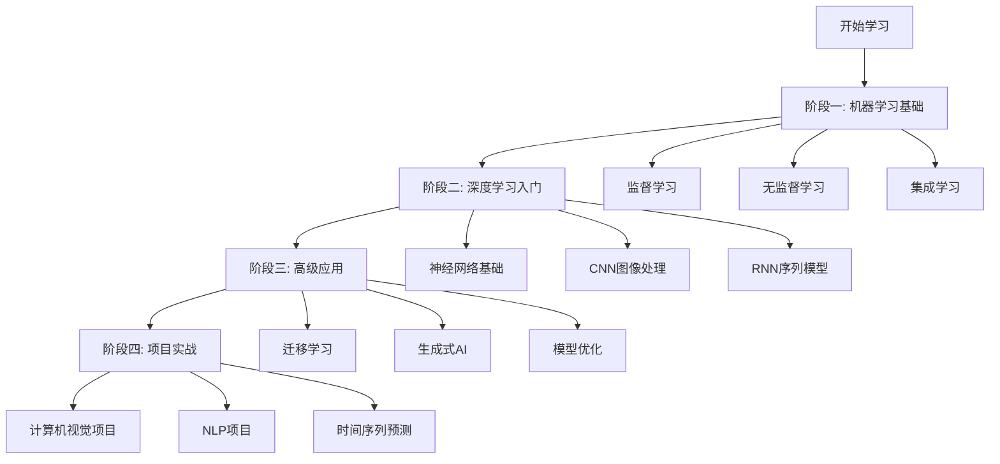

# AI-Practices: 机器学习与深度学习全栈教程

<div align="center">

[](https://www.python.org/downloads/)
[](https://www.tensorflow.org/)
[](https://pytorch.org/)
[](LICENSE)
[](https://github.com/yourusername/AI-Practices)

**一个全面、系统、实战导向的中文机器学习与深度学习教程**

[快速开始](#快速开始) • [学习路线](#学习路线) • [内容概览](#内容概览) • [环境配置](#环境配置) • [贡献指南](#贡献指南)

</div>

---

## 📚 项目简介

本项目是一个**全面系统的机器学习与深度学习实战教程库**，包含 **113+ Jupyter Notebooks** 和 **21+ 详细文档**，涵盖从基础机器学习到高级深度学习的完整学习路径。

### 🎯 项目特色

- **📖 系统全面**: 覆盖机器学习、深度学习、计算机视觉、自然语言处理等核心领域
- **💻 代码实战**: 每个概念都配有完整可运行的代码示例
- **🎓 循序渐进**: 从基础到高级，适合不同水平的学习者
- **🔬 理论结合实践**: 详细的理论说明 + 实际项目案例
- **🇨🇳 中文友好**: 全中文文档和注释，降低学习门槛
- **🔄 持续更新**: 跟进最新的技术和最佳实践

### 📊 内容统计

| 类别 | 数量 | 说明 |
|-----|------|------|
| Jupyter Notebooks | 113+ | 完整的代码实现和可视化 |
| Markdown 文档 | 21+ | 理论讲解和知识总结 |
| 主要主题 | 15+ | 从线性回归到生成式AI |
| 实战项目 | 10+ | 端到端的完整项目 |

---

## 🗺️ 学习路线



### 🎓 推荐学习顺序

#### 📘 **阶段一: 机器学习基础** (4-6周)

适合有Python基础但没有ML经验的初学者

1. **训练模型** → 线性回归、逻辑回归、正则化
2. **决策树与集成学习** → 决策树、随机森林、XGBoost
3. **支持向量机** → SVM分类与回归
4. **降维** → PCA、t-SNE
5. **无监督学习** → K-Means、DBSCAN

#### 📗 **阶段二: 深度学习入门** (4-6周)

掌握深度学习框架和基础架构

1. **Keras基础** → 构建第一个神经网络
2. **TensorFlow基础** → 数据处理和模型训练
3. **卷积神经网络** → 图像分类和目标检测
4. **循环神经网络** → 序列数据处理
5. **训练技巧** → Dropout、Batch Normalization

#### 📕 **阶段三: 高级应用** (6-8周)

深入理解高级概念和架构

1. **计算机视觉** → 目标检测、图像分割、风格迁移
2. **自然语言处理** → 词嵌入、LSTM、Transformer
3. **生成式AI** → GAN、VAE、文本生成
4. **模型优化** → 超参数调优、模型集成、剪枝

#### 📙 **阶段四: 项目实战** (持续)

通过实际项目巩固所学

1. 端到端项目实现
2. 数据收集与预处理
3. 模型部署与优化
4. 性能监控与改进

---

## 📑 内容概览

### 📂 项目结构

```
AI-Practices/
│
├── 📁 机器学习实战/                      # 机器学习基础和深度学习入门
│   ├── 📁 机器学习基础知识/
│   │   ├── 📁 训练模型/                 # 线性回归、逻辑回归、正则化
│   │   ├── 📁 Decision Tree/           # 决策树算法
│   │   ├── 📁 Support Vector Machine/  # 支持向量机
│   │   ├── 📁 降维/                     # PCA、t-SNE等降维算法
│   │   ├── 📁 无监督学习/               # 聚类算法
│   │   ├── 📁 集成学习和随机森林/       # Bagging、Boosting
│   │   ├── 📁 分类/                     # MNIST分类实战
│   │   └── 📁 端到端机器学习项目/       # 完整项目案例
│   │
│   └── 📁 神经网络和深度学习/
│       ├── 📁 Keras人工神经网络简介/   # Keras框架入门
│       ├── 📁 Tensorflow加载和预处理数据/  # 数据处理
│       ├── 📁 使用Tensorflow自定义模型和训练/  # 自定义层和训练循环
│       ├── 📁 使用卷积神经网络的深度计算机视觉/  # CNN实战
│       ├── 📁 使用RNN和CNN处理序列/     # 序列模型
│       ├── 📁 使用RNN和注意力机制进行NLP/  # 自然语言处理
│       └── 📁 训练深度学习网络/         # 训练技巧和优化
│
├── 📁 python深度学习红书/                # 高级深度学习内容
│   ├── 📁 深度学习用于计算机视觉/
│   │   ├── 卷积网络小型实例/
│   │   ├── 卷积神经网络可视化/
│   │   └── 猫狗分类模型/               # 完整的CV项目
│   │
│   ├── 📁 深度学习用于文本和序列/
│   │   ├── 处理文本数据/               # 文本预处理和词嵌入
│   │   ├── 理解循环神经网络/           # RNN基础
│   │   ├── 循环神经网络的高级用法/     # LSTM、GRU
│   │   └── 用卷积神经网络处理序列/     # 1D CNN
│   │
│   ├── 📁 生成式深度学习/
│   │   ├── 使用LSTM生成文本/           # 文本生成
│   │   ├── 生成式对抗网络/             # GAN实现
│   │   └── DeepDream/                  # 风格迁移
│   │
│   ├── 📁 高级的深度学习最佳实践/
│   │   ├── 使用函数API/                # Keras高级API
│   │   ├── 多输入多输出模型/
│   │   ├── TensorBoard监控/
│   │   └── 让模型性能发挥到极致/       # 优化技巧
│   │
│   └── 📁 总结/
│       ├── 密集层连接网络.ipynb
│       ├── 卷积神经网络.ipynb
│       ├── 循环神经网络.ipynb
│       └── 什么数据用什么网络结构.md   # 重要参考指南
│
├── 📁 激活函数与损失函数/                # 基础参考资料
│   ├── 常见激活函数及其图像/
│   └── 损失函数/
│
├── 📄 requirements.txt                   # Python依赖
├── 📄 environment.yml                    # Conda环境配置
└── 📄 README.md                          # 本文件
```

### 🔑 核心主题

#### 1️⃣ **机器学习基础**

<details>
<summary>点击展开详细内容</summary>

- **线性模型**: LinearRegression, LogisticRegression, Ridge, Lasso, ElasticNet
- **决策树**: 分类与回归树、剪枝、可视化
- **支持向量机**: 线性SVM、核技巧、RBF核
- **集成学习**: Bagging, Boosting, RandomForest, XGBoost, AdaBoost
- **无监督学习**: K-Means, DBSCAN, 层次聚类
- **降维**: PCA, KernelPCA, t-SNE, LLE

**实战项目**:
- 波士顿房价预测
- MNIST手写数字识别
- 客户分群分析

</details>

#### 2️⃣ **深度学习框架**

<details>
<summary>点击展开详细内容</summary>

**Keras**:
- Sequential API
- Functional API
- Subclassing API
- 自定义层和损失函数
- 回调函数和TensorBoard

**TensorFlow**:
- 张量操作
- 自动微分
- 数据管道 (tf.data)
- 模型保存和加载
- 分布式训练

**PyTorch**:
- 基础张量操作
- 自定义损失函数
- 动态计算图

</details>

#### 3️⃣ **计算机视觉**

<details>
<summary>点击展开详细内容</summary>

- **基础CNN**: 卷积层、池化层、全连接层
- **经典架构**: LeNet, AlexNet, VGG, ResNet, Inception
- **迁移学习**: 使用预训练模型、微调
- **目标检测**: YOLO, R-CNN系列
- **图像分割**: U-Net, Mask R-CNN
- **生成式模型**: GAN, VAE, StyleGAN

**实战项目**:
- 猫狗分类
- 花卉识别
- DeepDream风格迁移

</details>

#### 4️⃣ **自然语言处理**

<details>
<summary>点击展开详细内容</summary>

- **文本预处理**: Tokenization, 词嵌入, One-hot编码
- **词向量**: Word2Vec, GloVe, FastText
- **序列模型**: RNN, LSTM, GRU
- **注意力机制**: Self-Attention, Multi-head Attention
- **预训练模型**: BERT, GPT (概念介绍)
- **应用**: 情感分析、文本分类、文本生成

**实战项目**:
- IMDB情感分析
- 使用LSTM生成文本
- 温度预测 (时间序列)

</details>

#### 5️⃣ **生成式AI**

<details>
<summary>点击展开详细内容</summary>

- **生成对抗网络 (GAN)**: 基础GAN、DCGAN、条件GAN
- **变分自编码器 (VAE)**: 编码器-解码器架构
- **文本生成**: 字符级RNN、LSTM文本生成
- **图像生成**: DeepDream、Neural Style Transfer

</details>

#### 6️⃣ **模型优化与部署**

<details>
<summary>点击展开详细内容</summary>

- **正则化**: L1/L2正则化、Dropout、Early Stopping
- **标准化**: Batch Normalization, Layer Normalization
- **优化器**: SGD, Adam, RMSprop, AdaGrad
- **学习率调度**: 学习率衰减、Warm-up
- **超参数调优**: Grid Search, Random Search, Bayesian Optimization
- **模型集成**: Voting, Stacking, Blending

</details>

---

## 🚀 快速开始

### 环境配置

#### 方法1: 使用Conda (推荐)

```bash
# 克隆仓库
git clone https://github.com/yourusername/AI-Practices.git
cd AI-Practices

# 创建conda环境
conda env create -f environment.yml

# 激活环境
conda activate ai-practices

# 启动Jupyter Notebook
jupyter notebook
```

#### 方法2: 使用pip

```bash
# 克隆仓库
git clone https://github.com/yourusername/AI-Practices.git
cd AI-Practices

# 创建虚拟环境
python -m venv venv

# 激活虚拟环境
# Windows:
venv\Scripts\activate
# Linux/Mac:
source venv/bin/activate

# 安装依赖
pip install -r requirements.txt

# 启动Jupyter Notebook
jupyter notebook
```

### 📝 开始第一个教程

```bash
# 运行第一个线性回归示例
cd 机器学习实战/机器学习基础知识/训练模型
jupyter notebook LinearRegression.ipynb
```

### 💡 使用说明

1. **按照学习路线**: 建议按照[学习路线](#学习路线)的顺序学习
2. **运行所有代码**: 每个notebook都可以完整运行，建议亲自执行
3. **修改和实验**: 鼓励修改参数和代码，观察结果变化
4. **完成练习**: 部分章节包含练习题，务必完成
5. **查阅文档**: 遇到问题时查看对应的Markdown文档

---

## 📖 详细文档

### 核心概念文档

- [📘 什么数据用什么网络结构](python深度学习红书/总结/什么数据用什么网络结构.md) - **必读指南**
- [📙 机器学习的通用流程](python深度学习红书/总结/机器学习的通用流程.md)
- [📕 如何看待深度学习](python深度学习红书/总结/如何看待深度学习.md)
- [📗 人工智能各种方法类别](python深度学习红书/总结/人工智能各种方法类别.md)

### 算法详解

- [决策树笔记](机器学习实战/机器学习基础知识/Decision%20Tree/Decision%20Tree%20笔记.md)
- [支持向量机笔记](机器学习实战/机器学习基础知识/Support%20Vector%20Machine/第五章笔记.md)
- [降维算法总结](机器学习实战/机器学习基础知识/降维/降维.md)
- [集成学习笔记](机器学习实战/机器学习基础知识/集成学习和随机森林/第七章笔记.md)

### 框架使用

- [Keras神经网络简介](机器学习实战/神经网络和深度学习/Keras人工神经网络简介/Keras神经网络简介.md)
- [TensorFlow数据处理](机器学习实战/神经网络和深度学习/Tensorflow加载和预处理数据/TensorFlow加载和预处理数据.md)
- [TensorFlow自定义化](机器学习实战/神经网络和深度学习/使用Tensorflow自定义模型和训练/Tensorflow高度自定义化.md)

---

## 🛠️ 技术栈

### 核心框架

| 框架 | 版本 | 用途 |
|-----|------|------|
| TensorFlow | 2.13+ | 深度学习主框架 |
| Keras | 2.13+ | 高层API |
| PyTorch | 2.0+ | 深度学习框架 |
| Scikit-learn | 1.3+ | 机器学习库 |

### 数据处理

- NumPy 1.24+
- Pandas 2.0+
- SciPy 1.10+

### 可视化

- Matplotlib 3.7+
- Seaborn 0.12+
- Plotly 5.14+

### 其他工具

- XGBoost 1.7+ (梯度提升)
- OpenCV 4.8+ (计算机视觉)
- NLTK 3.8+ (自然语言处理)
- Transformers 4.30+ (预训练模型)

---

## ❓ 常见问题

遇到问题？查看我们的 **[FAQ文档](FAQ.md)**，包含：

- 🔧 环境配置问题
- 📓 Jupyter Notebook问题
- 🧠 深度学习框架问题
- 🎮 GPU和CUDA问题
- 📊 数据处理问题
- 🎯 模型训练问题
- ⚡ 性能优化问题

---

## 🚀 实战项目

准备好将所学应用到实践了吗？查看 **[实战项目模块](实战项目/README.md)**：

- 🖼️ 计算机视觉项目（图像分类、目标检测）
- 📝 自然语言处理项目（情感分析、文本分类）
- 📈 时间序列项目（股票预测、销量预测）
- 🎮 推荐系统项目
- 🎨 生成式AI项目

---

## 📚 参考资源

### 推荐书籍

1. **《Python深度学习》** - François Chollet
   - 本项目的主要参考书籍之一
   - Keras作者亲自撰写

2. **《机器学习实战》** - Peter Harrington
   - 经典机器学习入门书籍

3. **《深度学习》** - Ian Goodfellow
   - 深度学习领域的圣经

### 在线资源

- [TensorFlow官方教程](https://www.tensorflow.org/tutorials)
- [PyTorch官方教程](https://pytorch.org/tutorials/)
- [Scikit-learn文档](https://scikit-learn.org/stable/)
- [Keras文档](https://keras.io/)

### 相关项目

- [MachineLearning](https://github.com/allmachinelearning/MachineLearning)
- [100-Days-Of-ML-Code](https://github.com/MLEveryday/100-Days-Of-ML-Code)
- [CV计算机视觉](https://github.com/AccumulateMore/CV)

---

## 🤝 贡献指南

欢迎所有形式的贡献！无论是修复错误、改进文档还是添加新内容。

### 如何贡献

1. Fork 本仓库
2. 创建您的特性分支 (`git checkout -b feature/AmazingFeature`)
3. 提交您的更改 (`git commit -m 'Add some AmazingFeature'`)
4. 推送到分支 (`git push origin feature/AmazingFeature`)
5. 开启一个Pull Request

### 贡献类型

- 📝 改进文档和注释
- 🐛 修复代码错误
- ✨ 添加新的示例和教程
- 🎨 改进可视化效果
- 🔧 优化代码性能
- 📚 翻译文档

### 代码规范

- 遵循PEP 8代码风格
- 为所有函数和类添加文档字符串
- 使用有意义的变量名
- 添加必要的注释

---

## 📊 项目状态

- ✅ 机器学习基础内容完成
- ✅ 深度学习框架教程完成
- ✅ 计算机视觉内容完成
- ✅ 自然语言处理内容完成
- 🚧 强化学习内容开发中
- 🚧 模型部署教程开发中

---

## ⭐ Star History

如果这个项目对您有帮助，请给我们一个⭐️！

[](https://star-history.com/#yourusername/AI-Practices&Date)

---

## 📄 许可证

本项目采用 [MIT License](LICENSE) 许可证。

---

## 📬 联系方式

- 📧 Email: your.email@example.com
- 💬 Issues: [GitHub Issues](https://github.com/yourusername/AI-Practices/issues)
- 🐦 Twitter: [@yourhandle](https://twitter.com/yourhandle)

---

## 🙏 致谢

感谢以下资源和项目的启发：

- François Chollet的《Python深度学习》
- Peter Harrington的《机器学习实战》
- TensorFlow和Keras团队
- 所有为本项目贡献的开发者

---

<div align="center">

**⭐ 如果觉得有用，请给个Star支持一下！**

Made with ❤️ by AI Learners

[⬆ 回到顶部](#ai-practices-机器学习与深度学习全栈教程)

</div>
