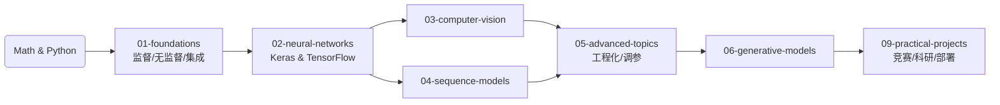
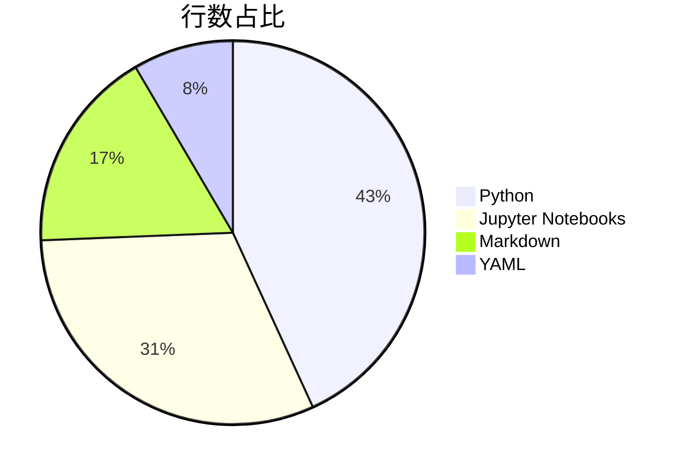
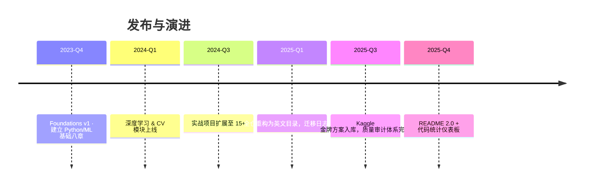

# AI-Practices · 中文 AI 全栈实验室

<div align="center">

[English](./README_EN.md) | 简体中文

[](./LICENSE)
[](https://github.com/zimingttkx/AI-Practices/stargazers)
[](https://github.com/zimingttkx/AI-Practices/network/members)
[](https://github.com/zimingttkx/AI-Practices/issues)
[](https://github.com/zimingttkx/AI-Practices/commits/main)


[](https://github.com/zimingttkx/AI-Practices/graphs/contributors)

</div>

> 这是我本人在科研、竞赛与教学中逐步沉淀的 AI 实践库，涵盖**机器学习**、**深度学习**、**计算机视觉**、**自然语言处理**、**序列建模**、**生成式 AI** 与 **Kaggle 竞赛方案**复盘，所有笔记与脚本均由我亲自编写与调试。

**关键词**: Machine Learning · Deep Learning · Computer Vision · NLP · PyTorch · TensorFlow · Keras · Jupyter Notebooks · Kaggle · 中文教程 · AI Tutorial · Neural Networks · CNN · RNN · Transformer · GAN

---

## 📌 项目快照

| 维度 | 数据 |
|------|------|
| 📒 Jupyter Notebooks | **113+**（含可复现实验、课堂 DEMO） |
| 🧠 主要模块 | **8 个分册**（01-foundations ~ 08-theory-notes） |
| 🧾 辅助文档 | **30+ Markdown**（教程、日志、审计报告） |
| 🚀 实战项目 | **19 个端到端案例**（分类、CV、NLP、时间序列、推荐、生成式 AI） |
| 🧪 质量记录 | `CONTENT_AUDIT_*`、`NOTEBOOK_QUALITY_REPORT.md`、`migration_log.json` |

---

## 🗂️ 目录速览

| 目录 | 说明 | 示例内容 |
|------|------|----------|
| `01-foundations/` | 机器学习基础八章 | 训练模型、集成学习、无监督、端到端项目 |
| `02-neural-networks/` | 深度学习基石 | Keras/TensorFlow 框架、训练技巧、自定义 Loop |
| `03-computer-vision/` | 视觉专题 | CNN 基础、经典架构、迁移学习、可视化 |
| `04-sequence-models/` | 序列与 NLP | RNN/LSTM/Transformer、词嵌入、序列到序列 |
| `05-advanced-topics/` | 工程与优化 | Functional API、回调、TensorBoard、超参调优 |
| `06-generative-models/` | 生成式 AI | AutoEncoder、GAN、VAE、文本生成、DeepDream |
| `08-theory-notes/` | 理论图谱 | 激活函数全集、损失函数全集、架构/优化器笔记 |
| `09-practical-projects/` | 项目工坊 | Kaggle / 产业项目脚本，含数据下载与训练管线 |
| `docs/` | 操作文档 | CODE_STYLE、NOTEBOOK_GUIDE、OPTIMIZATION_REPORT 等 |
| `utils/` | 工具模块 | `common.py`、`visualization.py`、`paths.py` |

---

## 🧭 学习 / 研发路线



每一章节都包含：
- `README.md`：目标、知识图谱、依赖
- `notes/`：Why / What / When / How / Watch Out 结构
- `notebooks/`：可运行示例（含 GPU / CPU 版本）
- `code/` 或 `src/`：模块化训练脚本

---

## 📊 代码与文档统计

| 文件类型 | 行数 | 占比 | 主要角色 |
|----------|------|------|----------|
| Python (`.py`) | **64,692** | **43%** | 训练脚本、工具库、评估与部署 |
| Notebook (`.ipynb`) | **46,787** | **31%** | 课堂 Demo、实验记录、Kaggle 复盘 |
| Markdown (`.md`) | **25,749** | **17%** | 理论笔记、报告、日志 |
| YAML (`.yml/.yaml`) | **12,673** | **9%** | 环境、流水线、超参配置 |

> 统计时间：2025-11（排除 `.git` 与缓存目录）。后续更新会同步在 README。



## 📈 GitHub 趋势监控

> 下图由自动化脚本抓取 GitHub API（Stars/Forks）并每日更新一次，方便追踪仓库热度随时间的变化。数据快照可在 `docs/assets/github-trends.json` 中查阅。


---

## 🧩 模块解剖

### 01 · Foundations  
- 线性与逻辑回归、梯度下降、正则化  
- 决策树、随机森林、XGBoost、SVM、聚类、降维  
- `08-end-to-end-project/` 包含完整的 ML 管道（数据→特征→模型→部署建议）

### 02 · Neural Networks  
- Sequential vs Functional API、回调体系、TensorBoard  
- `03-custom-models-training/` 展示自定义 Layer/Loss 及训练循环  
- `04-data-loading-preprocessing/` 专注 `tf.data`、数据增强与混合精度

### 03 · Computer Vision  
- `01-cnn-basics/`：卷积/池化/BN/正则  
- `02-classic-architectures/`：LeNet→AlexNet→VGG→ResNet→Inception  
- `03-transfer-learning/` & `04-object-detection/`：含迁移、检测、可视化、Grad-CAM

### 04 · Sequence Models  
- `01-rnn-basics/`：RNN/LSTM/GRU 核心  
- `03-text-processing/`：IMDB 中文情感分析、词嵌入、注意力  
- `05-sequence-to-sequence/`：Transformer、机器翻译、CTC

### 05 · Advanced Topics  
- Functional API DAG、多输入多输出  
- 回调与 TensorBoard 监控策略  
- Hyper-parameter 搜索、模型压缩、部署思路

### 06 · Generative Models  
- AutoEncoder / VAE / GAN / DCGAN / 风格迁移 / Text Generation  
- `激活函数与损失函数/` 中配套的图谱与 Notebook 可直接调用

### 08 · Theory Notes  
- `activation-functions/activation-functions-complete.md`：30+ 激活函数逐项比较  
- `loss-functions/loss-functions-complete.md`：回归/分类/排序/高级 loss 全景  
- `architectures/`：网络拓扑、Regularization、Optimizer 速查

### 09 · Practical Projects  
- **ML 基础**：Titanic、生存预测、Otto 分类、客户分群  
- **CV**：MNIST CNN、猫狗分类、CIFAR10、目标检测、RSNA 影像  
- **NLP**：LSTM 情感分析、Transformer 文本分类/NER、聊天机器人  
- **时间序列**：温度、销量、股票预测（LSTM + Prophet）  
- **推荐系统**：MovieLens NCF、协同过滤、混合策略  
- **生成式 AI**：DCGAN 图像生成、LSTM 文本生成、风格迁移  
- **Kaggle 方案**：RSNA 2023/2024、Feedback-Prize、American Express

---

## 🔧 工具与质量体系

- `utils/common.py`：随机种子、设备检测、计时器、数据集切分  
- `utils/visualization.py`：训练曲线、混淆矩阵、错误案例可视化  
- `docs/NOTEBOOK_QUALITY_REPORT.md`：记录每个 Notebook 的运行状态、依赖版本、输出截图  
- `docs/CONTENT_AUDIT_COMPLETION_REPORT.md` & `migration_log.json`：追踪从中文目录到英文结构的映射  
- `docs/OPTIMIZATION_REPORT.md`：列出每次大规模重构与得分

---

## 🚀 快速启动

```bash
# 克隆
git clone https://github.com/yourusername/AI-Practices.git
cd AI-Practices

# 创建与激活环境
conda create -n ai-practices python=3.10 -y
conda activate ai-practices

# 安装核心依赖
pip install -r requirements.txt

# 若需 GPU / Kaggle 方案
python -m pip install -U torch torchvision torchaudio --index-url https://download.pytorch.org/whl/cu121
pip install tensorflow==2.13.1
pip install -r 09-practical-projects/requirements.txt
```

### 示例：运行 MNIST CNN

```bash
cd 09-practical-projects/02_计算机视觉项目/01_MNIST手写数字识别_CNN入门
python src/data.py --download
python src/train.py --model improved_cnn --epochs 20
python src/evaluate.py --checkpoint runs/improved_cnn.best.pt
```

---

## 📅 更新节奏



**近期待办**  
- [ ] `08-theory-notes/optimizers/` 完成优化器对照表  
- [ ] `03-computer-vision/02-classic-architectures/` 增补训练日志、性能曲线  
- [ ] `04-sequence-models/05-sequence-to-sequence/` 添加 Transformer 推理脚本  
- [ ] `09-practical-projects/05_Kaggle竞赛项目/` 更新 2024-2025 最新比赛复盘

---

## 🙌 致谢 & 参考仓库

- [PyTorch](https://github.com/pytorch/pytorch) / [TensorFlow](https://github.com/tensorflow/tensorflow) / [Keras](https://github.com/keras-team/keras) / [JAX](https://github.com/google/jax)：深度学习实验主力框架  
- [scikit-learn](https://github.com/scikit-learn/scikit-learn) / [XGBoost](https://github.com/dmlc/xgboost) / [LightGBM](https://github.com/microsoft/LightGBM) / [CatBoost](https://github.com/catboost/catboost)：经典 ML 基线  
- [Hugging Face Transformers](https://github.com/huggingface/transformers) ：NLP 模型与 tokenizer 复现基础  
- [Albumentations](https://github.com/albumentations-team/albumentations) / [OpenMMLab MMDetection](https://github.com/open-mmlab/mmdetection)：计算机视觉增强与检测参考实作  
- [Kaggle 官方仓库](https://github.com/Kaggle/kaggle-api) 及社区 Kernel：提供真实数据集与竞赛脚本灵感  
- [Matplotlib](https://github.com/matplotlib/matplotlib) / [Seaborn](https://github.com/mwaskom/seaborn) / [Plotly](https://github.com/plotly/plotly.py)：可视化主力工具

如你在学习或研究中使用了 AI-Practices，欢迎在 Issue 中分享成果或提出改进建议。  
**AI-Practices · Maintained with ❤️ + curiosity.**
