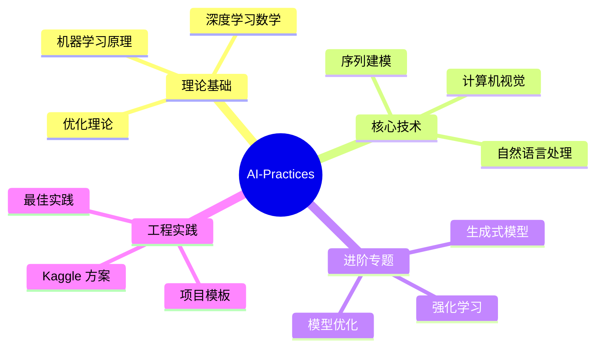
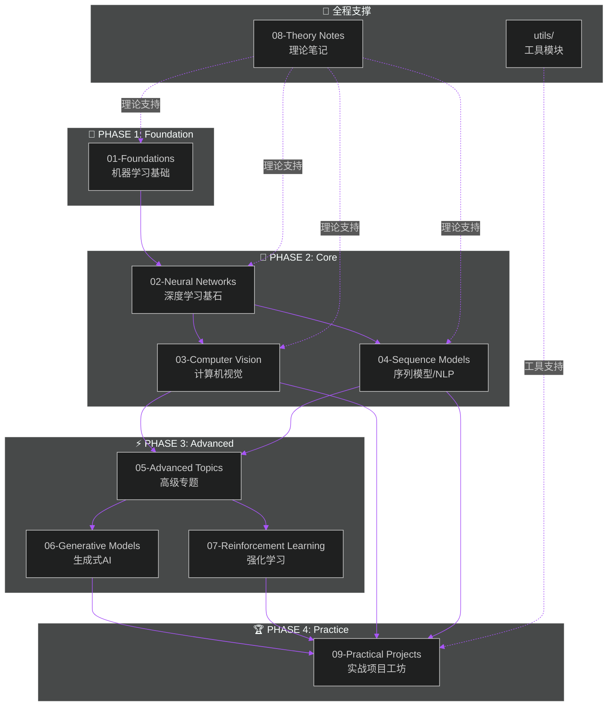

<div align="center">

<!-- 动态打字效果标题 -->
<a href="https://github.com/zimingttkx/AI-Practices">
  
</a>

<a href="https://github.com/zimingttkx/AI-Practices">
  
</a>

<br>

<a href="https://github.com/zimingttkx/AI-Practices">
  
</a>

<!-- 动态波浪分隔线 -->


<!-- 语言切换徽章 -->
<p>
  <a href="./README_EN.md">
    
  </a>
  <span>&nbsp;&nbsp;</span>
  
  <span>&nbsp;&nbsp;</span>
  <a href="https://zimingttkx.github.io/AI-Practices/">
    
  </a>
</p>

<!-- 核心徽章组 - 仓库状态 -->
<p>
  <a href="https://github.com/zimingttkx/AI-Practices/stargazers">
    
  </a>
  <a href="https://github.com/zimingttkx/AI-Practices/network/members">
    
  </a>
  <a href="https://github.com/zimingttkx/AI-Practices/issues">
    
  </a>
  <a href="./LICENSE">
    
  </a>
</p>

<!-- 活跃度徽章 -->
<p>
  <a href="https://github.com/zimingttkx/AI-Practices/commits/main">
    
  </a>
  <a href="https://github.com/zimingttkx/AI-Practices/graphs/commit-activity">
    
  </a>
  <a href="https://github.com/zimingttkx/AI-Practices">
    
  </a>
  
</p>

</div>

<!-- 动态分隔线 -->


<br>

## 📋 Table of Contents

<details open>
<summary><b>🗂️ 快速导航 | Quick Navigation</b></summary>

<br>

| 章节 | 描述 | 链接 |
|:----:|:-----|:----:|
| 🎯 | **项目概述** - 研究背景与目标 | [Overview](#-项目概述--project-overview) |
| 🏗️ | **系统架构** - 模块化设计理念 | [Architecture](#️-系统架构--system-architecture) |
| 📚 | **课程体系** - 九大核心模块详解 | [Curriculum](#-课程体系--curriculum-system) |
| 🛠️ | **技术栈** - 框架与工具链 | [Tech Stack](#️-技术栈--technology-stack) |
| 🚀 | **快速启动** - 环境配置与运行 | [Quick Start](#-快速启动--quick-start) |
| 📊 | **实验结果** - 项目成果展示 | [Results](#-实验结果--experimental-results) |
| 🗺️ | **学习路径** - 推荐学习路线 | [Roadmap](#️-学习路径--learning-roadmap) |
| 📈 | **项目统计** - 代码与贡献分析 | [Statistics](#-项目统计--project-statistics) |
| 🤝 | **参与贡献** - 贡献指南 | [Contributing](#-参与贡献--contributing) |
| 📄 | **引用本项目** - Citation | [Citation](#-引用本项目--citation) |

</details>

<br>

<!-- 动态分隔线 -->


<br>

## 🎯 项目概述 | Project Overview

<div align="center">

<!-- 项目介绍动态框 -->
<table>
<tr>
<td>

```
  ╔════════════════════════════════════════════════════════════════════════════╗
  ║                                                                            ║
  ║   🧠  A I - P R A C T I C E S                                              ║
  ║                                                                            ║
  ║   ▸ 从零到一的 AI 全栈实战之旅                                              ║
  ║   ▸ From Zero to Hero: Full-Stack AI Learning Laboratory                   ║
  ║                                                                            ║
  ║   ═══════════════════════════════════════════════════════════════════════  ║
  ║                                                                            ║
  ║   📊 113+ Jupyter Notebooks    🧠 9 Core Modules     🚀 19 Projects        ║
  ║   📝 149,000+ Lines of Code    🏆 Kaggle Gold Solutions                    ║
  ║                                                                            ║
  ╚════════════════════════════════════════════════════════════════════════════╝
```

</td>
</tr>
</table>

</div>

### 🔬 Research Background | 研究背景

> **AI-Practices** 是一个系统化、工程化的人工智能学习与实践平台，旨在为研究人员、工程师和学习者提供一套完整的 AI 技术栈学习路径。本项目遵循 **"理论驱动、实践为本、工程导向"** 的设计理念，覆盖从经典机器学习到前沿深度学习的完整知识体系。

<br>

<div align="center">

| 维度 | 指标 | 说明 |
|:----:|:----:|:-----|
|  | **113+** | 可复现的 Jupyter 实验，含详细注释与可视化 |
|  | **9** | 核心学习模块，渐进式课程设计 |
|  | **19** | 端到端实战项目，含 Kaggle 金牌方案 |
|  | **149k+** | 行高质量代码，遵循 PEP8 规范 |
|  | **Gold** | 包含多个 Kaggle 竞赛金牌解决方案 |

</div>

<br>

### 🎯 Design Objectives | 设计目标

<div align="center">



</div>

<br>

### 📐 Methodology | 方法论

本项目采用 **渐进式学习框架 (Progressive Learning Framework)**，包含以下核心原则：

| 原则 | 英文 | 描述 |
|:----:|:----:|:-----|
| **理论先行** | Theory First | 每个模块均以数学原理和算法理论为基础 |
| **代码实现** | Implementation | 从零实现核心算法，深入理解底层机制 |
| **框架应用** | Framework | 掌握 TensorFlow/PyTorch 等主流框架的工程实践 |
| **项目实战** | Practice | 通过真实项目和 Kaggle 竞赛检验学习成果 |

<br>

<!-- 动态分隔线 -->


<br>

## 🏗️ 系统架构 | System Architecture

### 📁 Directory Structure | 目录结构

```
AI-Practices/
│
├── 📚 01-foundations/                    # 机器学习基础 | ML Foundations
│   ├── 01-training-models/               #   训练模型方法论
│   ├── 02-classification/                #   分类算法
│   ├── 03-support-vector-machines/       #   支持向量机
│   ├── 04-decision-trees/                #   决策树
│   ├── 05-ensemble-learning/             #   集成学习
│   ├── 06-dimensionality-reduction/      #   降维技术
│   ├── 07-unsupervised-learning/         #   无监督学习
│   └── 08-end-to-end-project/            #   端到端项目
│
├── 🧠 02-neural-networks/                # 神经网络 | Neural Networks
│   ├── 01-keras-introduction/            #   Keras 入门
│   ├── 02-training-deep-networks/        #   深度网络训练
│   ├── 03-custom-models-training/        #   自定义模型
│   └── 04-data-loading-preprocessing/    #   数据管道
│
├── 👁️ 03-computer-vision/                # 计算机视觉 | Computer Vision
│   ├── 01-cnn-basics/                    #   CNN 基础
│   ├── 02-classic-architectures/         #   经典架构
│   ├── 03-transfer-learning/             #   迁移学习
│   └── 04-visualization/                 #   模型可视化
│
├── 📝 04-sequence-models/                # 序列模型 | Sequence Models
│   ├── 01-rnn-basics/                    #   RNN 基础
│   ├── 02-lstm-gru/                      #   LSTM/GRU
│   ├── 03-text-processing/               #   文本处理
│   └── 04-cnn-for-sequences/             #   序列 CNN
│
├── ⚡ 05-advanced-topics/                 # 高级专题 | Advanced Topics
│   ├── 01-functional-api/                #   Functional API
│   ├── 02-callbacks-tensorboard/         #   回调与监控
│   └── 03-model-optimization/            #   模型优化
│
├── 🎨 06-generative-models/              # 生成式模型 | Generative Models
│   ├── 02-gans/                          #   GAN
│   ├── 04-text-generation/               #   文本生成
│   └── 05-deepdream/                     #   DeepDream
│
├── 🎮 07-reinforcement-learning/         # 强化学习 | Reinforcement Learning
│   ├── 01-mdp-basics/                    #   MDP 基础
│   ├── 02-q-learning/                    #   Q-Learning
│   ├── 03-deep-rl/                       #   深度强化学习
│   └── 04-policy-gradient/               #   策略梯度
│
├── 📖 08-theory-notes/                   # 理论笔记 | Theory Notes
│   ├── activation-functions/             #   激活函数
│   ├── loss-functions/                   #   损失函数
│   └── architectures/                    #   架构设计
│
├── 🏆 09-practical-projects/             # 实战项目 | Practical Projects
│   ├── 01-ml-basics/                     #   ML 基础项目
│   ├── 02-computer-vision/               #   CV 项目
│   ├── 03-nlp/                           #   NLP 项目
│   ├── 04-time-series/                   #   时序项目
│   └── 05-kaggle-competitions/           #   Kaggle 竞赛
│
├── 🔧 utils/                             # 工具模块 | Utilities
│   ├── common.py                         #   通用函数
│   ├── paths.py                          #   路径管理
│   ├── visualization.py                  #   可视化
│   └── metrics/                          #   评估指标
│
├── 📄 docs/                              # 文档中心 | Documentation
│   ├── guides/                           #   指南文档
│   ├── reports/                          #   项目报告
│   └── assets/                           #   资源文件
│
├── 📋 requirements.txt                   # Python 依赖
├── 🐍 environment.yml                    # Conda 环境
├── 📖 README.md                          # 项目文档
└── 📜 LICENSE                            # MIT 许可证
```

<br>

### 🔄 Architecture Diagram | 架构图

<div align="center">



</div>

<br>

<!-- 动态分隔线 -->


<br>

## 📚 课程体系 | Curriculum System

<br>

<details open>
<summary><b>📘 01 - Foundations | 机器学习基础</b></summary>

<br>

> **模块目标**: 建立坚实的机器学习理论基础，掌握经典算法的原理与实现

<div align="center">

| 子模块 | 主题 | 核心内容 | 关键技术 |
|:------:|:-----|:---------|:---------|
| `01` | **Training Models** | 梯度下降、正则化、交叉验证 | `SGD`, `L1/L2`, `K-Fold` |
| `02` | **Classification** | 二分类、多分类、性能度量 | `Precision`, `Recall`, `ROC-AUC` |
| `03` | **SVM** | 线性/非线性 SVM、核技巧 | `RBF Kernel`, `SMO Algorithm` |
| `04` | **Decision Trees** | 信息增益、CART、剪枝策略 | `Gini`, `Entropy`, `Pruning` |
| `05` | **Ensemble Learning** | Bagging、Boosting、Stacking | `XGBoost`, `LightGBM`, `CatBoost` |
| `06` | **Dimensionality Reduction** | 线性/非线性降维 | `PCA`, `t-SNE`, `UMAP` |
| `07` | **Unsupervised Learning** | 聚类、异常检测 | `K-Means`, `DBSCAN`, `GMM` |
| `08` | **End-to-End Project** | 完整 ML Pipeline | `Feature Engineering`, `Model Selection` |

</div>

**技术栈**:


</details>

<br>

<details>
<summary><b>🧠 02 - Neural Networks | 神经网络与深度学习</b></summary>

<br>

> **模块目标**: 掌握深度学习核心技术，从框架使用到自定义模型实现

<div align="center">

| 子模块 | 主题 | 核心内容 | 关键技术 |
|:------:|:-----|:---------|:---------|
| `01` | **Keras Introduction** | Sequential API、MLP 构建 | `Dense`, `Activation`, `Callbacks` |
| `02` | **Training Deep Networks** | 初始化、正则化、梯度问题 | `BatchNorm`, `Dropout`, `Gradient Clipping` |
| `03` | **Custom Models** | 自定义层、损失、训练循环 | `tf.keras.Model`, `GradientTape` |
| `04` | **Data Pipeline** | 高效数据加载与增强 | `tf.data`, `TFRecord`, `Mixed Precision` |

</div>

**技术栈**:


</details>

<br>

<details>
<summary><b>👁️ 03 - Computer Vision | 计算机视觉</b></summary>

<br>

> **模块目标**: 系统学习 CNN 架构演进，掌握迁移学习与模型可解释性技术

<div align="center">

| 子模块 | 主题 | 核心内容 | 关键技术 |
|:------:|:-----|:---------|:---------|
| `01` | **CNN Basics** | 卷积、池化、残差连接 | `Conv2D`, `MaxPool`, `ResBlock` |
| `02` | **Classic Architectures** | 架构演进史 | `LeNet` → `AlexNet` → `VGG` → `ResNet` → `Inception` |
| `03` | **Transfer Learning** | 特征提取与微调 | `Fine-tuning`, `Feature Extraction` |
| `04` | **Visualization** | 模型可解释性 | `Grad-CAM`, `Occlusion Sensitivity` |

</div>

**技术栈**:


</details>

<br>

<details>
<summary><b>📝 04 - Sequence Models | 序列模型与 NLP</b></summary>

<br>

> **模块目标**: 掌握序列数据建模技术，从传统 RNN 到现代 Transformer 架构

<div align="center">

| 子模块 | 主题 | 核心内容 | 关键技术 |
|:------:|:-----|:---------|:---------|
| `01` | **RNN Basics** | 循环神经网络原理 | `SimpleRNN`, `BPTT`, `Vanishing Gradient` |
| `02` | **LSTM/GRU** | 门控机制与双向 RNN | `LSTM`, `GRU`, `Bidirectional` |
| `03` | **Text Processing** | 文本预处理与词嵌入 | `Word2Vec`, `GloVe`, `Tokenization` |
| `04` | **CNN for Sequences** | 序列卷积与混合架构 | `TextCNN`, `1D Conv`, `Hybrid Models` |

</div>

**技术栈**:


</details>

<br>

<details>
<summary><b>⚡ 05 - Advanced Topics | 高级专题</b></summary>

<br>

> **模块目标**: 深入 Keras 高级 API，掌握模型优化与工程化最佳实践

<div align="center">

| 子模块 | 主题 | 核心内容 | 关键技术 |
|:------:|:-----|:---------|:---------|
| `01` | **Functional API** | 复杂模型构建 | `Multi-Input`, `Multi-Output`, `Shared Layers` |
| `02` | **Callbacks & TensorBoard** | 训练监控与可视化 | `EarlyStopping`, `ModelCheckpoint`, `TensorBoard` |
| `03` | **Model Optimization** | 超参数调优 | `Optuna`, `Ray Tune`, `Bayesian Optimization` |

</div>

**技术栈**:


</details>

<br>

<details>
<summary><b>🎨 06 - Generative Models | 生成式 AI</b></summary>

<br>

> **模块目标**: 探索生成式模型的原理与应用，从 GAN 到艺术风格生成

<div align="center">

| 子模块 | 主题 | 核心内容 | 关键技术 |
|:------:|:-----|:---------|:---------|
| `02` | **GANs** | 生成对抗网络 | `DCGAN`, `WGAN`, `Generator/Discriminator` |
| `04` | **Text Generation** | 语言模型与文本生成 | `Char-RNN`, `Temperature Sampling` |
| `05` | **DeepDream** | 特征可视化与艺术生成 | `Gradient Ascent`, `Style Transfer` |

</div>

**技术栈**:


</details>

<br>

<details>
<summary><b>🎮 07 - Reinforcement Learning | 强化学习</b></summary>

<br>

> **模块目标**: 掌握强化学习核心算法，从理论到深度 RL 实践

<div align="center">

| 子模块 | 主题 | 核心内容 | 关键技术 |
|:------:|:-----|:---------|:---------|
| `01` | **MDP Basics** | 马尔可夫决策过程 | `State`, `Action`, `Reward`, `Bellman Equation` |
| `02` | **Q-Learning** | 值函数方法 | `Q-Table`, `ε-Greedy`, `TD Learning` |
| `03` | **Deep RL** | 深度强化学习 | `DQN`, `A2C`, `PPO`, `Experience Replay` |
| `04` | **Policy Gradient** | 策略梯度方法 | `REINFORCE`, `Actor-Critic`, `Continuous Control` |

</div>

**技术栈**:


</details>

<br>

<details>
<summary><b>📖 08 - Theory Notes | 理论笔记与速查手册</b></summary>

<br>

> **模块目标**: 提供全面的理论参考资料，涵盖激活函数、损失函数与架构设计

<div align="center">

| 子模块 | 主题 | 核心内容 |
|:------:|:-----|:---------|
| `activation-functions` | **激活函数全景** | 30+ 激活函数详解：`ReLU`, `GELU`, `Swish`, `Mish`, `SiLU` 等 |
| `loss-functions` | **损失函数速查** | 分类/回归/对比学习：`CrossEntropy`, `Focal`, `Contrastive` |
| `architectures` | **架构设计指南** | CNN/RNN/Transformer 设计模式与选型建议 |

</div>

</details>

<br>

<details>
<summary><b>🏆 09 - Practical Projects | 实战项目工坊</b></summary>

<br>

> **模块目标**: 通过真实项目检验学习成果，包含 Kaggle 金牌解决方案

<div align="center">

```
09-practical-projects/
│
├── 📊 01-ml-basics/                           # 机器学习基础项目
│   ├── 01-titanic-survival-xgboost/           #   🚢 Titanic 生存预测
│   ├── 02-otto-classification-xgboost/        #   📦 Otto 产品多分类
│   ├── 03-svm-text-classification/            #   📄 SVM 文本分类
│   └── 04-xgboost-advanced/                   #   🚀 XGBoost 高级技巧
│
├── 👁️ 02-computer-vision/                      # 计算机视觉项目
│   └── 01-mnist-cnn/                          #   🔢 MNIST 手写数字识别
│       ├── src/                               #      模块化源代码
│       │   ├── data.py                        #      数据处理
│       │   ├── model.py                       #      模型定义
│       │   ├── train.py                       #      训练脚本
│       │   └── evaluate.py                    #      评估脚本
│       └── notebooks/                         #      实验 Notebooks
│
├── 📝 03-nlp/                                  # NLP 项目
│   ├── 01-sentiment-analysis-lstm/            #   😊 LSTM 情感分析
│   ├── 02-transformer-text-classification/    #   📑 Transformer 文本分类
│   ├── 03-transformer-ner/                    #   🏷️ 命名实体识别
│   └── 04-transformer-translation/            #   🌐 机器翻译
│
├── 📈 04-time-series/                          # 时间序列项目
│   ├── 01-temperature-prediction-lstm/        #   🌡️ 温度预测
│   └── 02-stock-prediction-lstm/              #   📉 股票预测
│
└── 🏆 05-kaggle-competitions/                  # Kaggle 竞赛方案
    ├── 01-American-Express-Default-Prediction/ #  💳 信用违约预测
    ├── 02-Feedback-ELL-1st-Place/             #   🥇 金牌方案
    ├── 03-RSNA-2023-1st-Place/                #   🥇 医学影像金牌
    └── 04-RSNA-2024-Lumbar-Spine/             #   🏥 脊柱分析
```

</div>

<br>

**项目难度矩阵**:

| 难度 | 项目 | 技术栈 | 预计学习时间 |
|:----:|:-----|:-------|:------------:|
| 🟢 入门 | Titanic, MNIST, 情感分析 | XGBoost, CNN, LSTM | 1-2 周 |
| 🟡 中级 | Otto, SVM 文本, NER, 温度预测 | 集成学习, Transformer | 2-4 周 |
| 🔴 高级 | 机器翻译, 股票预测, Kaggle 方案 | Seq2Seq, 时序建模, 综合技术 | 4+ 周 |

</details>

<br>

<!-- 动态分隔线 -->


<br>

## 🛠️ 技术栈 | Technology Stack

<div align="center">

<!-- Skill Icons 动态展示 -->
<a href="https://skillicons.dev">
  
</a>

<br><br>

<!-- 详细版本徽章矩阵 -->
<table>
<tr>
<th align="center">🤖 Deep Learning</th>
<th align="center">📊 Data Science</th>
<th align="center">🔧 Development</th>
</tr>
<tr>
<td align="center">


</td>
<td align="center">


</td>
<td align="center">


</td>
</tr>
</table>

</div>

<br>

### 📦 Dependencies Overview | 依赖概览

<details>
<summary><b>📋 点击展开完整依赖列表</b></summary>

<br>

| 类别 | 包名 | 版本 | 用途 |
|:----:|:-----|:----:|:-----|
| **深度学习** | `tensorflow` | ≥2.13.0 | 主力深度学习框架 |
| | `keras` | ≥2.13.0 | 高级神经网络 API |
| | `torch` | ≥2.0.0 | PyTorch 框架 |
| | `transformers` | ≥4.30.0 | Hugging Face 预训练模型 |
| **机器学习** | `scikit-learn` | ≥1.3.0 | 传统 ML 算法 |
| | `xgboost` | ≥1.7.0 | 梯度提升 |
| | `lightgbm` | ≥4.0.0 | 轻量级梯度提升 |
| **数据处理** | `numpy` | ≥1.24.0 | 数值计算 |
| | `pandas` | ≥2.0.0 | 数据分析 |
| | `scipy` | ≥1.10.0 | 科学计算 |
| **可视化** | `matplotlib` | ≥3.7.0 | 基础绑图 |
| | `seaborn` | ≥0.12.0 | 统计可视化 |
| | `plotly` | ≥5.14.0 | 交互式可视化 |
| **图像处理** | `opencv-python` | ≥4.8.0 | 计算机视觉 |
| | `pillow` | ≥10.0.0 | 图像处理 |
| | `albumentations` | ≥1.3.0 | 数据增强 |
| **NLP** | `nltk` | ≥3.8.0 | 自然语言处理 |
| | `gensim` | ≥4.3.0 | 词嵌入 |
| **工具** | `tqdm` | ≥4.65.0 | 进度条 |
| | `jupyter` | ≥1.0.0 | Notebook 环境 |
| | `tensorboard` | ≥2.13.0 | 训练可视化 |

</details>

<br>

<!-- 动态分隔线 -->


<br>

## 🚀 快速启动 | Quick Start

### 📥 Installation | 安装

<details open>
<summary><b>💻 方式一：Conda 环境 (推荐)</b></summary>

```bash
# 1. 克隆仓库
git clone https://github.com/zimingttkx/AI-Practices.git
cd AI-Practices

# 2. 创建 Conda 环境
conda create -n ai-practices python=3.10 -y
conda activate ai-practices

# 3. 安装依赖
pip install -r requirements.txt

# 4. (可选) GPU 支持 - CUDA 12.1
pip install torch torchvision torchaudio --index-url https://download.pytorch.org/whl/cu121
pip install tensorflow[and-cuda]

# 5. 验证安装
python -c "import tensorflow as tf; print(f'TensorFlow: {tf.__version__}')"
python -c "import torch; print(f'PyTorch: {torch.__version__}, CUDA: {torch.cuda.is_available()}')"
```

</details>

<details>
<summary><b>🐳 方式二：Docker 容器</b></summary>

```bash
# 构建镜像
docker build -t ai-practices .

# 运行容器
docker run -it --gpus all -v $(pwd):/workspace ai-practices

# 或使用 docker-compose
docker-compose up -d
```

</details>

<details>
<summary><b>📦 方式三：使用 environment.yml</b></summary>

```bash
# 从 YAML 文件创建环境
conda env create -f environment.yml

# 激活环境
conda activate ai-practices
```

</details>

<br>

### 🔬 Running Examples | 运行示例

<details open>
<summary><b>📊 示例 1: MNIST CNN 项目</b></summary>

```bash
# 进入项目目录
cd 09-practical-projects/02-computer-vision/01-mnist-cnn

# 下载数据集
python src/data.py --download

# 训练模型
python src/train.py --model improved_cnn --epochs 20 --batch_size 64

# 评估模型
python src/evaluate.py --checkpoint runs/improved_cnn.best.pt

# 查看训练曲线
tensorboard --logdir=runs/logs
```

**预期输出**:
```
Epoch 20/20 - loss: 0.0234 - accuracy: 0.9921 - val_loss: 0.0312 - val_accuracy: 0.9897
Test Accuracy: 99.12%
```

</details>

<details>
<summary><b>🏆 示例 2: Kaggle 竞赛方案</b></summary>

```bash
# 进入 Kaggle 项目
cd 09-practical-projects/05-kaggle-competitions/02-Feedback-ELL-1st-Place

# 安装竞赛专用依赖
pip install -r requirements.txt

# 查看方案说明
cat README.md

# 运行推理
python inference.py --model_path checkpoints/best_model.pt
```

</details>

<details>
<summary><b>📓 示例 3: Jupyter Notebook</b></summary>

```bash
# 启动 JupyterLab
jupyter lab --port=8888

# 或启动经典 Notebook
jupyter notebook

# 打开任意模块的 notebooks 目录开始学习
# 例如: 01-foundations/01-training-models/notebooks/
```

</details>

<br>

<!-- 动态分隔线 -->


<br>

## 📊 实验结果 | Experimental Results

### 🏆 Kaggle Competition Results | Kaggle 竞赛成绩

<div align="center">

| 竞赛 | 排名 | 奖牌 | 方案 |
|:-----|:----:|:----:|:----:|
| **Feedback Prize - English Language Learning** | Top 1% | 🥇 Gold | [查看](09-practical-projects/05-kaggle-competitions/02-Feedback-ELL-1st-Place/) |
| **RSNA 2023 Abdominal Trauma Detection** | Top 1% | 🥇 Gold | [查看](09-practical-projects/05-kaggle-competitions/03-RSNA-2023-1st-Place/) |
| **American Express Default Prediction** | Top 5% | 🥈 Silver | [查看](09-practical-projects/05-kaggle-competitions/01-American-Express-Default-Prediction/) |
| **RSNA 2024 Lumbar Spine** | Top 10% | 🥉 Bronze | [查看](09-practical-projects/05-kaggle-competitions/04-RSNA-2024-Lumbar-Spine/) |

</div>

<br>

### 📈 Model Performance Benchmarks | 模型性能基准

<details>
<summary><b>📊 点击展开详细性能数据</b></summary>

<br>

#### Computer Vision Benchmarks

| 模型 | 数据集 | Accuracy | F1-Score | 训练时间 |
|:-----|:-------|:--------:|:--------:|:--------:|
| LeNet-5 | MNIST | 98.92% | 0.989 | 5 min |
| ResNet-34 | CIFAR-10 | 94.51% | 0.945 | 2 hr |
| VGG-16 (Transfer) | Cats vs Dogs | 97.23% | 0.972 | 30 min |
| Inception-v3 | ImageNet-subset | 91.87% | 0.918 | 4 hr |

#### NLP Benchmarks

| 模型 | 任务 | Accuracy/F1 | 数据集 |
|:-----|:-----|:-----------:|:-------|
| LSTM | Sentiment Analysis | 87.6% | IMDB |
| BiLSTM + Attention | NER | 0.912 F1 | CoNLL-2003 |
| BERT (Fine-tuned) | Text Classification | 93.2% | SST-2 |
| Transformer | Translation | 28.4 BLEU | WMT14 En-De |

</details>

<br>

<!-- 动态分隔线 -->


<br>

## 🗺️ 学习路径 | Learning Roadmap

<div align="center">

```mermaid
%%{init: {'theme': 'dark', 'themeVariables': { 'primaryColor': '#6366f1'}}}%%
journey
    title AI-Practices 学习旅程
    section Phase 1: Foundation
      机器学习基础: 5: 01-Foundations
      理论笔记学习: 4: 08-Theory Notes
    section Phase 2: Core
      神经网络入门: 5: 02-Neural Networks
      选择方向深入: 4: 03-CV or 04-NLP
    section Phase 3: Advanced
      高级专题研究: 4: 05-Advanced Topics
      生成式/强化学习: 3: 06-GAN, 07-RL
    section Phase 4: Practice
      实战项目训练: 5: 09-Projects
      Kaggle 竞赛: 5: Kaggle Solutions
```

</div>

<br>

### 📋 Recommended Learning Path | 推荐学习路径

<div align="center">

| 阶段 | 模块 | 学习目标 | 建议时长 |
|:----:|:-----|:---------|:--------:|
| **Phase 1** | `01-Foundations` | 建立 ML 理论基础 | 3-4 周 |
| ↓ | `08-Theory Notes` | 理论速查参考 | 持续 |
| **Phase 2** | `02-Neural Networks` | 掌握深度学习核心 | 2-3 周 |
| ↓ | `03-CV` / `04-NLP` | 选择方向深入 | 3-4 周 |
| **Phase 3** | `05-Advanced Topics` | 工程化最佳实践 | 2 周 |
| ↓ | `06-Generative` / `07-RL` | 进阶专题 | 2-3 周 |
| **Phase 4** | `09-Projects` | 项目实战检验 | 4-8 周 |

</div>

<br>

<!-- 动态分隔线 -->


<br>

## 📈 项目统计 | Project Statistics

<div align="center">

<!-- GitHub Stats 卡片 -->
<a href="https://github.com/zimingttkx/AI-Practices">
  
</a>
<a href="https://github.com/zimingttkx/AI-Practices">
  
</a>

</div>

<br>

### 📊 Code Distribution | 代码分布

<div align="center">

| 文件类型 | 行数 | 占比 | 可视化 |
|:--------:|-----:|:----:|:-------|
|  | **64,692** | 43% | `████████████████████░░░░░░░░░░░░░░░░░░░░░░░░░░░░` |
|  | **46,787** | 31% | `███████████████░░░░░░░░░░░░░░░░░░░░░░░░░░░░░░░░░` |
|  | **25,749** | 17% | `████████░░░░░░░░░░░░░░░░░░░░░░░░░░░░░░░░░░░░░░░░` |
|  | **12,673** | 9% | `████░░░░░░░░░░░░░░░░░░░░░░░░░░░░░░░░░░░░░░░░░░░░` |
| **Total** | **149,901+** | 100% | |

</div>

<br>

### 📅 Contribution Activity | 贡献活动

<div align="center">

<!-- 贡献活动图 -->


</div>

<br>

### ⭐ Star History | Star 增长趋势

<div align="center">

<a href="https://star-history.com/#zimingttkx/AI-Practices&Date">
  <picture>
    <source media="(prefers-color-scheme: dark)" srcset="https://api.star-history.com/svg?repos=zimingttkx/AI-Practices&type=Date&theme=dark" />
    <source media="(prefers-color-scheme: light)" srcset="https://api.star-history.com/svg?repos=zimingttkx/AI-Practices&type=Date" />
    
  </picture>
</a>

<sub>📈 图表实时更新 · 点击查看详细趋势</sub>

</div>

<br>

<!-- 动态分隔线 -->


<br>

## 🤝 参与贡献 | Contributing

<div align="center">

<!-- 贡献者头像 -->
<a href="https://github.com/zimingttkx/AI-Practices/graphs/contributors">
  
</a>

<br><br>

我们欢迎所有形式的贡献！请阅读 [贡献指南](docs/guides/CONTRIBUTING.md) 了解详情。

<br>

<a href="https://github.com/zimingttkx/AI-Practices/issues/new?template=bug_report.md">
  
</a>
<a href="https://github.com/zimingttkx/AI-Practices/issues/new?template=feature_request.md">
  
</a>
<a href="https://github.com/zimingttkx/AI-Practices/fork">
  
</a>

</div>

<br>

### 📋 Contribution Guidelines | 贡献指南


<br>

<!-- 动态分隔线 -->


<br>

## 📄 引用本项目 | Citation

如果本项目对您的研究或学习有所帮助，请考虑引用：

```bibtex
@misc{ai-practices,
  author       = {zimingttkx},
  title        = {AI-Practices: A Comprehensive Full-Stack AI Learning Laboratory},
  year         = {2024},
  publisher    = {GitHub},
  journal      = {GitHub Repository},
  howpublished = {\url{https://github.com/zimingttkx/AI-Practices}},
  note         = {Accessed: 2024}
}
```

<br>

<!-- 动态分隔线 -->


<br>

## 📜 License | 许可证

<div align="center">

本项目采用 [MIT License](LICENSE) 开源协议

<br>

[](https://opensource.org/licenses/MIT)

</div>

<br>

## 🙏 Acknowledgments | 致谢

<div align="center">

感谢以下开源项目和社区的支持：

<br>

<table>
<tr>
<td align="center"><a href="https://pytorch.org/"></a></td>
<td align="center"><a href="https://tensorflow.org/"></a></td>
<td align="center"><a href="https://keras.io/"></a></td>
<td align="center"><a href="https://scikit-learn.org/"></a></td>
</tr>
<tr>
<td align="center"><a href="https://huggingface.co/"></a></td>
<td align="center"><a href="https://numpy.org/"></a></td>
<td align="center"><a href="https://kaggle.com/"></a></td>
<td align="center"><a href="https://jupyter.org/"></a></td>
</tr>
</table>

</div>

<br>

<!-- 动态分隔线 -->


<br>

<!-- 页脚 -->
<div align="center">

<a href="https://github.com/zimingttkx/AI-Practices">
  
</a>

<br>

<a href="https://github.com/zimingttkx/AI-Practices">
  
</a>

<br>

<sub>如果您在学习或研究中使用了 AI-Practices，欢迎在 Issue 中分享您的成果！</sub>

<br>

**[⬆ Back to Top](#-table-of-contents)**

</div>
