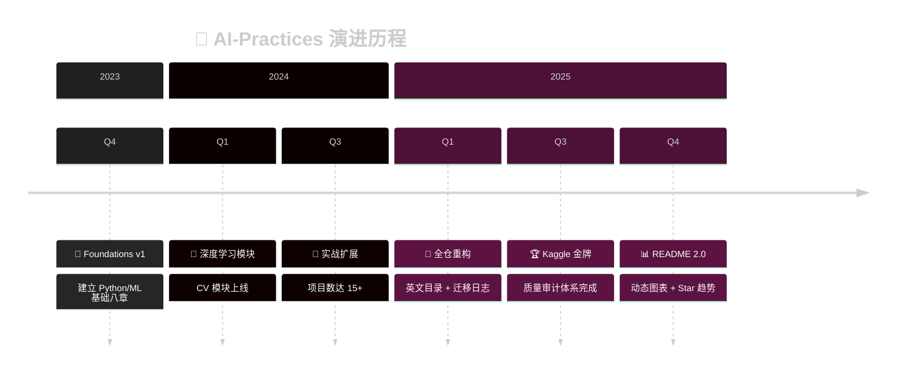

<div align="center">

<!-- 动态打字效果标题 -->
<a href="https://github.com/zimingttkx/AI-Practices">
  
</a>

<a href="https://github.com/zimingttkx/AI-Practices">
  
</a>

<!-- 动态波浪分隔线 -->


<!-- 语言切换 -->
<p>
  <a href="./README_EN.md">
    
  </a>
  <span> · </span>
  
</p>

<!-- 核心徽章组 - 第一行：仓库状态 -->
<p>
  <a href="https://github.com/zimingttkx/AI-Practices/stargazers">
    
  </a>
  <a href="https://github.com/zimingttkx/AI-Practices/network/members">
    
  </a>
  <a href="https://github.com/zimingttkx/AI-Practices/issues">
    
  </a>
  <a href="./LICENSE">
    
  </a>
</p>

<!-- 核心徽章组 - 第二行：活跃度 -->
<p>
  <a href="https://github.com/zimingttkx/AI-Practices/commits/main">
    
  </a>
  <a href="https://github.com/zimingttkx/AI-Practices/graphs/commit-activity">
    
  </a>
  <a href="https://github.com/zimingttkx/AI-Practices">
    
  </a>
</p>

<!-- 访问计数器 -->
<p>
  
  
</p>

<!-- 动态波浪分隔线 -->


</div>

<!-- 项目介绍卡片 -->
<div align="center">
<table>
<tr>
<td>

```
  ╔══════════════════════════════════════════════════════════════════╗
  ║                                                                  ║
  ║   🧠  从零到一的 AI 实战之旅                                      ║
  ║                                                                  ║
  ║   涵盖 机器学习 · 深度学习 · 计算机视觉 · NLP · 生成式AI · RL    ║
  ║                                                                  ║
  ║   113+ Notebooks  ·  19 实战项目  ·  149k+ 行代码                ║
  ║                                                                  ║
  ║   Kaggle 金牌方案复盘  ·  完整学习路径  ·  中文详细注释          ║
  ║                                                                  ║
  ╚══════════════════════════════════════════════════════════════════╝
```

</td>
</tr>
</table>
</div>

<!-- SEO 关键词 (隐藏) -->
<!--
Keywords: Machine Learning, Deep Learning, Computer Vision, NLP, PyTorch, TensorFlow,
Keras, Jupyter Notebooks, Kaggle, 中文教程, AI Tutorial, Neural Networks, CNN, RNN,
Transformer, GAN, Reinforcement Learning, 机器学习, 深度学习, 人工智能
-->

<br>

<!-- ==================== 技术栈展示 ==================== -->
<div align="center">

## 🛠️ 技术栈 | Tech Stack

<!-- 使用 Skill Icons 展示技术栈 -->
<a href="https://skillicons.dev">
  
</a>

<br><br>

<!-- 详细版本徽章 -->
<p>
  
  
  
  
  
  
  
  
</p>

</div>

<br>

<!-- ==================== Star 历史图 ==================== -->
<div align="center">

## ⭐ Star 增长趋势 | Star History

<div align="center">

<!-- 实时 Star 计数 - 动态更新 -->
<a href="https://github.com/zimingttkx/AI-Practices/stargazers">
  
</a>
<a href="https://github.com/zimingttkx/AI-Practices/network/members">
  
</a>
<a href="https://github.com/zimingttkx/AI-Practices/watchers">
  
</a>

<br><br>

<!-- Star History 动态图表 - 自动追踪增长 -->
<a href="https://star-history.com/#zimingttkx/AI-Practices&Date">
  <picture>
    <source media="(prefers-color-scheme: dark)" srcset="https://api.star-history.com/svg?repos=zimingttkx/AI-Practices&type=Date&theme=dark" />
    <source media="(prefers-color-scheme: light)" srcset="https://api.star-history.com/svg?repos=zimingttkx/AI-Practices&type=Date" />
    
  </picture>
</a>

<sub>📈 图表自动更新 · 点击查看详细趋势</sub>

</div>

<br>

<!-- 仓库统计卡片 -->
<a href="https://github.com/zimingttkx/AI-Practices">
  
</a>

<!-- 贡献活动图 -->


</div>

<br>

<!-- 动态分隔线 -->


<br>

<!-- ==================== 项目快照 ==================== -->
## 📊 项目快照 | Project Snapshot

<div align="center">

<table>
<tr>
<td align="center" width="25%">
<br>
<sub><b>📒 Jupyter Notebooks</b></sub><br>
<sub>可复现实验 & Demo</sub>
</td>
<td align="center" width="25%">
<br>
<sub><b>🧠 核心模块</b></sub><br>
<sub>从基础到实战</sub>
</td>
<td align="center" width="25%">
<br>
<sub><b>🚀 实战项目</b></sub><br>
<sub>端到端案例</sub>
</td>
<td align="center" width="25%">
<br>
<sub><b>📝 代码行数</b></sub><br>
<sub>高质量代码</sub>
</td>
</tr>
</table>

</div>

<br>

<!-- ==================== 项目架构 ==================== -->
## 🗂️ 项目架构 | Project Structure

<br>

<div align="center">

<!-- 第一行：基础模块 -->
<table>
<tr>
<td align="center" width="33%">
<a href="01-foundations/">

<br><br>

</a>
<br><br>
<sub>回归 · 决策树 · SVM · 集成学习</sub>
<br>
<sub>聚类 · 降维 · 端到端项目</sub>
</td>
<td align="center" width="33%">
<a href="02-neural-networks/">

<br><br>

</a>
<br><br>
<sub>Keras · TensorFlow · 自定义训练</sub>
<br>
<sub>tf.data · 数据增强 · 混合精度</sub>
</td>
<td align="center" width="33%">
<a href="03-computer-vision/">

<br><br>

</a>
<br><br>
<sub>CNN · ResNet · Inception</sub>
<br>
<sub>迁移学习 · 目标检测 · Grad-CAM</sub>
</td>
</tr>
</table>

<br>

<!-- 第二行：进阶模块 -->
<table>
<tr>
<td align="center" width="33%">
<a href="04-sequence-models/">

<br><br>

</a>
<br><br>
<sub>RNN · LSTM · GRU · 词嵌入</sub>
<br>
<sub>Transformer · 机器翻译</sub>
</td>
<td align="center" width="33%">
<a href="05-advanced-topics/">

<br><br>

</a>
<br><br>
<sub>Functional API · 回调机制</sub>
<br>
<sub>超参调优 · 模型压缩 · 部署</sub>
</td>
<td align="center" width="33%">
<a href="06-generative-models/">

<br><br>

</a>
<br><br>
<sub>GAN · DCGAN · 文本生成</sub>
<br>
<sub>DeepDream · 风格迁移</sub>
</td>
</tr>
</table>

<br>

<!-- 第三行：专项模块 -->
<table>
<tr>
<td align="center" width="33%">
<a href="07-reinforcement-learning/">

<br><br>

</a>
<br><br>
<sub>MDP · Q-Learning · DQN</sub>
<br>
<sub>Policy Gradient · Actor-Critic</sub>
</td>
<td align="center" width="33%">
<a href="08-theory-notes/">

<br><br>

</a>
<br><br>
<sub>30+ 激活函数 · 损失函数全景</sub>
<br>
<sub>优化器速查 · 架构设计</sub>
</td>
<td align="center" width="33%">
<a href="09-practical-projects/">

<br><br>

</a>
<br><br>
<sub>ML · CV · NLP · 时序</sub>
<br>
<sub>Kaggle 金牌方案复现</sub>
</td>
</tr>
</table>

<br>

<!-- 辅助模块 -->
<table>
<tr>
<td align="center" width="50%">
<a href="docs/">

</a>
<br>
<sub>指南 · 报告 · 归档</sub>
</td>
<td align="center" width="50%">
<a href="utils/">

</a>
<br>
<sub>通用函数 · 可视化 · 路径管理</sub>
</td>
</tr>
</table>

</div>

<br>

<!-- ==================== 模块详情（折叠） ==================== -->
<details>
<summary><b>📂 点击展开各模块详细内容 | Click to expand module details</b></summary>

<br>

<table>
<tr><th>模块</th><th>主题</th><th>关键技术</th></tr>
<tr>
<td rowspan="3"><b>01 Foundations</b></td>
<td>监督学习</td><td><code>sklearn</code> · <code>XGBoost</code> · <code>LightGBM</code></td>
</tr>
<tr><td>无监督学习</td><td><code>K-Means</code> · <code>DBSCAN</code> · <code>PCA</code></td></tr>
<tr><td>端到端项目</td><td>特征工程 → 模型 → 部署</td></tr>
<tr>
<td rowspan="2"><b>02 Neural Networks</b></td>
<td>框架 & 训练</td><td><code>tf.keras</code> · <code>tf.GradientTape</code></td>
</tr>
<tr><td>数据处理</td><td><code>tf.data</code> · <code>Albumentations</code></td></tr>
<tr>
<td rowspan="2"><b>03 Computer Vision</b></td>
<td>经典架构</td><td><code>LeNet</code> → <code>ResNet</code> → <code>Inception</code></td>
</tr>
<tr><td>高级应用</td><td><code>YOLO</code> · <code>Grad-CAM</code> · <code>mmdetection</code></td></tr>
<tr>
<td rowspan="2"><b>04 Sequence Models</b></td>
<td>循环网络</td><td><code>RNN</code> · <code>LSTM</code> · <code>GRU</code></td>
</tr>
<tr><td>Transformer</td><td><code>Self-Attention</code> · <code>BERT</code> · <code>transformers</code></td></tr>
<tr>
<td rowspan="2"><b>05 Advanced Topics</b></td>
<td>工程化</td><td><code>Optuna</code> · <code>Ray Tune</code> · <code>TensorBoard</code></td>
</tr>
<tr><td>部署</td><td><code>ONNX</code> · <code>TensorRT</code> · <code>TFLite</code></td></tr>
<tr>
<td><b>06 Generative Models</b></td>
<td>生成模型</td><td><code>DCGAN</code> · <code>WGAN</code> · <code>StyleTransfer</code></td>
</tr>
<tr>
<td><b>07 Reinforcement Learning</b></td>
<td>强化学习</td><td><code>DQN</code> · <code>PPO</code> · <code>stable-baselines3</code></td>
</tr>
<tr>
<td><b>08 Theory Notes</b></td>
<td>理论速查</td><td>激活函数 · 损失函数 · 优化器</td>
</tr>
<tr>
<td><b>09 Practical Projects</b></td>
<td>实战项目</td><td>Kaggle · CV · NLP · 时序</td>
</tr>
</table>

</details>

<br>

<!-- ==================== 学习路线图 ==================== -->
## 🧭 学习路线图 | Learning Roadmap

<div align="center">

<table>
<tr>
<th align="center">🎯 PHASE 1<br><sub>基础</sub></th>
<th align="center">➜</th>
<th align="center">🧠 PHASE 2<br><sub>核心</sub></th>
<th align="center">➜</th>
<th align="center">⚡ PHASE 3<br><sub>进阶</sub></th>
<th align="center">➜</th>
<th align="center">🏆 PHASE 4<br><sub>实战</sub></th>
</tr>
<tr>
<td align="center">
<a href="01-foundations/"></a>
</td>
<td align="center">➜</td>
<td align="center">
<a href="02-neural-networks/"></a><br>
<sub>⬇</sub><br>
<a href="03-computer-vision/"></a>
<a href="04-sequence-models/"></a>
</td>
<td align="center">➜</td>
<td align="center">
<a href="05-advanced-topics/"></a><br>
<sub>⬇</sub><br>
<a href="06-generative-models/"></a>
<a href="07-reinforcement-learning/"></a>
</td>
<td align="center">➜</td>
<td align="center">
<a href="09-practical-projects/"></a>
</td>
</tr>
<tr>
<td align="center" colspan="7">
<a href="08-theory-notes/"></a>
</td>
</tr>
</table>

<sub>每个模块包含：<code>README.md</code> · <code>notes/</code> · <code>notebooks/</code> · <code>src/</code></sub>

</div>

<br>

<!-- ==================== 代码统计 ==================== -->
## 📈 代码统计 | Code Statistics

<br>

<div align="center">

<!-- GitHub 语言统计卡片 -->
<a href="https://github.com/zimingttkx/AI-Practices">
  
</a>

<br><br>

<!-- 代码行数统计 - 使用进度条样式 -->
<table>
<tr>
<td width="100%">

**📊 Total Lines: `149,901+`**

<br>


<br>


<br>


<br>


</td>
</tr>
</table>

<br>

<!-- 统计时间 -->
<sub>📅 统计时间：2025-11 | 排除 .git 与缓存目录</sub>

<br><br>

<!-- 仓库分析图 -->


</div>

<br>

<!-- 动态分隔线 -->


<br>

<!-- ==================== 快速启动 ==================== -->
## 🚀 快速启动 | Quick Start

<details open>
<summary><b>💻 环境配置</b></summary>

```bash
# 1️⃣ 克隆仓库
git clone https://github.com/zimingttkx/AI-Practices.git
cd AI-Practices

# 2️⃣ 创建虚拟环境
conda create -n ai-practices python=3.10 -y
conda activate ai-practices

# 3️⃣ 安装依赖
pip install -r requirements.txt

# 4️⃣ (可选) GPU 支持
pip install torch torchvision torchaudio --index-url https://download.pytorch.org/whl/cu121
pip install tensorflow[and-cuda]
```

</details>

<details>
<summary><b>🔬 运行示例 - MNIST CNN</b></summary>

```bash
cd 09-practical-projects/02-computer-vision/01-mnist-cnn

# 下载数据
python src/data.py --download

# 训练模型
python src/train.py --model improved_cnn --epochs 20

# 评估模型
python src/evaluate.py --checkpoint runs/improved_cnn.best.pt
```

</details>

<details>
<summary><b>📊 运行示例 - Kaggle 竞赛</b></summary>

```bash
cd 09-practical-projects/05-kaggle-competitions/

# 安装竞赛专用依赖
pip install -r requirements.txt

# 查看具体竞赛说明
cat 02-Feedback-ELL-1st-Place/README.md
```

</details>

<br>

<!-- ==================== 贡献者 ==================== -->
## 👥 贡献者 | Contributors

<div align="center">

<a href="https://github.com/zimingttkx/AI-Practices/graphs/contributors">
  
</a>

<br><br>

<!-- 贡献统计 -->


</div>

<br>

<!-- ==================== 更新时间线 ==================== -->
## 📅 更新时间线 | Timeline



<br>

<!-- ==================== 待办事项 ==================== -->
## 📋 开发计划 | Roadmap

<div align="center">

| 状态 | 任务 | 优先级 |
|:----:|:-----|:------:|
| 🔄 | `07-reinforcement-learning/` 完善 RL 内容 | 🔴 高 |
| 📝 | `08-theory-notes/optimizers/` 优化器对照表 | 🟡 中 |
| 📊 | `03-computer-vision/` 训练日志 & 性能曲线 | 🟡 中 |
| 🔧 | `04-sequence-models/` Transformer 推理脚本 | 🟡 中 |
| 🏆 | `09-practical-projects/` 2024-2025 竞赛复盘 | 🔴 高 |

</div>

<br>

<!-- ==================== 支持项目 ==================== -->
## 💖 支持项目 | Support

<div align="center">

如果这个项目对你有帮助，请考虑：

<a href="https://github.com/zimingttkx/AI-Practices/stargazers">
  
</a>
<a href="https://github.com/zimingttkx/AI-Practices/fork">
  
</a>
<a href="https://github.com/zimingttkx/AI-Practices/issues">
  
</a>
<a href="https://github.com/zimingttkx/AI-Practices/issues">
  
</a>

<br><br>

<!-- 打赏/赞助（可选） -->
<!--
<details>
<summary><b>☕ 请我喝杯咖啡</b></summary>
<br>


</details>
-->

</div>

<br>

<!-- ==================== 致谢 ==================== -->
## 🙏 致谢 | Acknowledgments

<div align="center">

<table>
<tr>
<td align="center"><a href="https://pytorch.org/"></a></td>
<td align="center"><a href="https://tensorflow.org/"></a></td>
<td align="center"><a href="https://keras.io/"></a></td>
<td align="center"><a href="https://scikit-learn.org/"></a></td>
</tr>
<tr>
<td align="center"><a href="https://huggingface.co/"></a></td>
<td align="center"><a href="https://xgboost.ai/"></a></td>
<td align="center"><a href="https://kaggle.com/"></a></td>
<td align="center"><a href="https://jupyter.org/"></a></td>
</tr>
</table>

</div>

<br>

<!-- ==================== 页脚 ==================== -->
<div align="center">


<br>

<a href="https://github.com/zimingttkx/AI-Practices">
  
</a>

<br>

**Made with ❤️ and 🧠 by [zimingttkx](https://github.com/zimingttkx)**

<sub>如果你在学习或研究中使用了 AI-Practices，欢迎在 Issue 中分享成果！</sub>

<br>

<a href="https://github.com/zimingttkx/AI-Practices">
  
</a>

</div>
