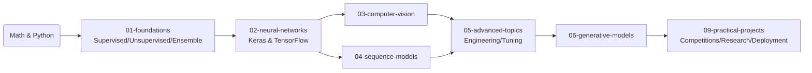
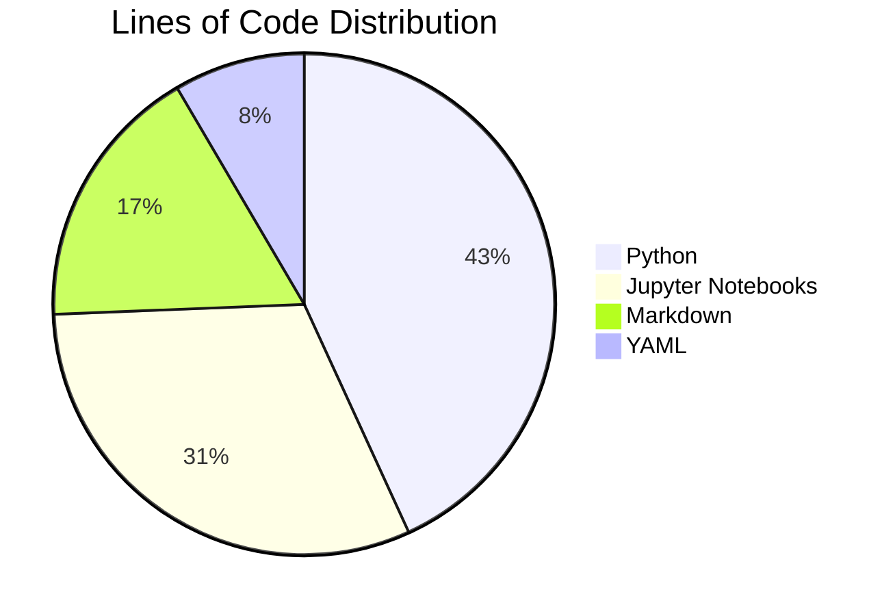
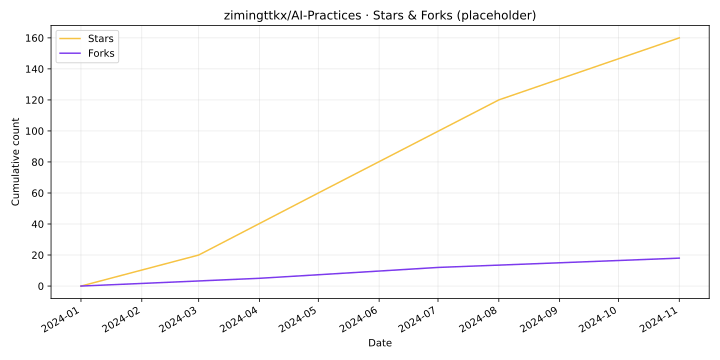
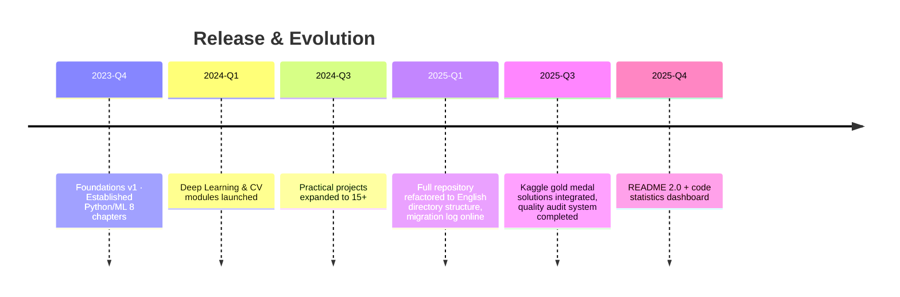

# AI-Practices · Full-Stack AI Learning Lab

<div align="center">

English | [简体中文](./README.md)

[](./LICENSE)
[](https://github.com/zimingttkx/AI-Practices/stargazers)
[](https://github.com/zimingttkx/AI-Practices/network/members)
[](https://github.com/zimingttkx/AI-Practices/issues)
[](https://github.com/zimingttkx/AI-Practices/commits/main)


[](https://github.com/zimingttkx/AI-Practices/graphs/contributors)

</div>

> A comprehensive AI learning repository covering **Machine Learning**, **Deep Learning**, **Computer Vision**, **Natural Language Processing**, **Sequence Modeling**, **Generative AI**, and **Kaggle Competition Solutions**. All notes and scripts are personally written and tested for research, competitions, and teaching.

**Keywords**: Machine Learning · Deep Learning · Computer Vision · NLP · PyTorch · TensorFlow · Keras · Jupyter Notebooks · Kaggle · Chinese Tutorial · AI Tutorial · Neural Networks · CNN · RNN · Transformer · GAN

---

## 📌 Project Snapshot

| Dimension | Data |
|-----------|------|
| 📒 Jupyter Notebooks | **113+** (reproducible experiments & classroom demos) |
| 🧠 Main Modules | **8 volumes** (01-foundations ~ 08-theory-notes) |
| 🧾 Documentation | **30+ Markdown files** (tutorials, logs, audit reports) |
| 🚀 Practical Projects | **19 end-to-end cases** (Classification, CV, NLP, Time Series, Recommender Systems, Generative AI) |
| 🧪 Quality Records | `CONTENT_AUDIT_*`, `NOTEBOOK_QUALITY_REPORT.md`, `migration_log.json` |

---

## 🗂️ Directory Overview

| Directory | Description | Example Content |
|-----------|-------------|-----------------|
| `01-foundations/` | Machine Learning Fundamentals (8 chapters) | Training models, ensemble learning, unsupervised learning, end-to-end projects |
| `02-neural-networks/` | Deep Learning Foundations | Keras/TensorFlow frameworks, training techniques, custom loops |
| `03-computer-vision/` | Computer Vision Topics | CNN basics, classic architectures, transfer learning, visualization |
| `04-sequence-models/` | Sequence & NLP | RNN/LSTM/Transformer, word embeddings, sequence-to-sequence |
| `05-advanced-topics/` | Engineering & Optimization | Functional API, callbacks, TensorBoard, hyperparameter tuning |
| `06-generative-models/` | Generative AI | AutoEncoder, GAN, VAE, text generation, DeepDream |
| `08-theory-notes/` | Theory Reference | Complete activation functions, loss functions, architecture/optimizer notes |
| `09-practical-projects/` | Project Workshop | Kaggle/industry project scripts with data download & training pipelines |
| `docs/` | Documentation | CODE_STYLE, NOTEBOOK_GUIDE, OPTIMIZATION_REPORT, etc. |
| `utils/` | Utility Modules | `common.py`, `visualization.py`, `paths.py` |

---

## 🧭 Learning / Research Roadmap



Each chapter includes:
- `README.md`: Objectives, knowledge graph, dependencies
- `notes/`: Why / What / When / How / Watch Out structure
- `notebooks/`: Runnable examples (GPU/CPU versions)
- `code/` or `src/`: Modular training scripts

---

## 📊 Code & Documentation Statistics

| File Type | Lines | Percentage | Primary Role |
|-----------|-------|------------|--------------|
| Python (`.py`) | **64,692** | **43%** | Training scripts, utility libraries, evaluation & deployment |
| Notebook (`.ipynb`) | **46,787** | **31%** | Classroom demos, experiment logs, Kaggle reviews |
| Markdown (`.md`) | **25,749** | **17%** | Theory notes, reports, logs |
| YAML (`.yml/.yaml`) | **12,673** | **9%** | Environment, pipelines, hyperparameter configs |

> Statistics as of November 2025 (excluding `.git` and cache directories). Updates will be synchronized in README.



## 📈 GitHub Trends Monitoring

> The chart below is automatically fetched from GitHub API (Stars/Forks) and updated daily to track repository popularity over time. Data snapshots are available in `docs/assets/github-trends.json`.



---

## 🧩 Module Breakdown

### 01 · Foundations

- Linear & logistic regression, gradient descent, regularization
- Decision trees, random forests, XGBoost, SVM, clustering, dimensionality reduction
- `08-end-to-end-project/` contains complete ML pipeline (data → features → model → deployment suggestions)

### 02 · Neural Networks

- Sequential vs Functional API, callback system, TensorBoard
- `03-custom-models-training/` demonstrates custom Layer/Loss and training loops
- `04-data-loading-preprocessing/` focuses on `tf.data`, data augmentation & mixed precision

### 03 · Computer Vision

- `01-cnn-basics/`: Convolution/pooling/BN/regularization
- `02-classic-architectures/`: LeNet → AlexNet → VGG → ResNet → Inception
- `03-transfer-learning/` & `04-object-detection/`: Transfer learning, detection, visualization, Grad-CAM

### 04 · Sequence Models

- `01-rnn-basics/`: RNN/LSTM/GRU fundamentals
- `03-text-processing/`: IMDB Chinese sentiment analysis, word embeddings, attention
- `05-sequence-to-sequence/`: Transformer, machine translation, CTC

### 05 · Advanced Topics

- Functional API DAG, multi-input/multi-output
- Callback & TensorBoard monitoring strategies
- Hyperparameter search, model compression, deployment approaches

### 06 · Generative Models

- AutoEncoder / VAE / GAN / DCGAN / Style Transfer / Text Generation
- Complementary charts & notebooks in `activation-functions & loss-functions/` can be directly invoked

### 08 · Theory Notes

- `activation-functions/activation-functions-complete.md`: 30+ activation functions comparison
- `loss-functions/loss-functions-complete.md`: Comprehensive loss functions for regression/classification/ranking/advanced
- `architectures/`: Network topology, regularization, optimizer quick reference

### 09 · Practical Projects

- **ML Basics**: Titanic survival prediction, Otto classification, customer segmentation
- **CV**: MNIST CNN, cats vs dogs, CIFAR10, object detection, RSNA medical imaging
- **NLP**: LSTM sentiment analysis, Transformer text classification/NER, chatbot
- **Time Series**: Temperature, sales, stock prediction (LSTM + Prophet)
- **Recommender Systems**: MovieLens NCF, collaborative filtering, hybrid strategies
- **Generative AI**: DCGAN image generation, LSTM text generation, style transfer
- **Kaggle Solutions**: RSNA 2023/2024, Feedback-Prize, American Express

---

## 🔧 Tools & Quality System

- `utils/common.py`: Random seeds, device detection, timers, dataset splitting
- `utils/visualization.py`: Training curves, confusion matrices, error case visualization
- `docs/NOTEBOOK_QUALITY_REPORT.md`: Records each notebook's execution status, dependency versions, output screenshots
- `docs/CONTENT_AUDIT_COMPLETION_REPORT.md` & `migration_log.json`: Tracks mapping from Chinese to English directory structure
- `docs/OPTIMIZATION_REPORT.md`: Lists each major refactoring and scores

---

## 🚀 Quick Start

```bash
# Clone
git clone https://github.com/zimingttkx/AI-Practices.git
cd AI-Practices

# Create & activate environment
conda create -n ai-practices python=3.10 -y
conda activate ai-practices

# Install core dependencies
pip install -r requirements.txt

# For GPU / Kaggle solutions
python -m pip install -U torch torchvision torchaudio --index-url https://download.pytorch.org/whl/cu121
pip install tensorflow==2.13.1
pip install -r 09-practical-projects/requirements.txt
```

### Example: Run MNIST CNN

```bash
cd 09-practical-projects/02_计算机视觉项目/01_MNIST手写数字识别_CNN入门
python src/data.py --download
python src/train.py --model improved_cnn --epochs 20
python src/evaluate.py --checkpoint runs/improved_cnn.best.pt
```

---

## 📅 Update Timeline



**Upcoming Tasks**

- [ ] Complete `08-theory-notes/optimizers/` optimizer comparison table
- [ ] Add training logs & performance curves to `03-computer-vision/02-classic-architectures/`
- [ ] Add Transformer inference scripts to `04-sequence-models/05-sequence-to-sequence/`
- [ ] Update `09-practical-projects/05_Kaggle竞赛项目/` with 2024-2025 latest competition reviews

---

## 🤝 Contributing

We welcome contributions! Please see [CONTRIBUTING.md](./CONTRIBUTING.md) for guidelines.

---

## 📄 License

This project is licensed under the MIT License - see the [LICENSE](./LICENSE) file for details.

---

## 🙌 Acknowledgments & References

- [PyTorch](https://github.com/pytorch/pytorch) / [TensorFlow](https://github.com/tensorflow/tensorflow) / [Keras](https://github.com/keras-team/keras) / [JAX](https://github.com/google/jax): Primary deep learning frameworks
- [scikit-learn](https://github.com/scikit-learn/scikit-learn) / [XGBoost](https://github.com/dmlc/xgboost) / [LightGBM](https://github.com/microsoft/LightGBM) / [CatBoost](https://github.com/catboost/catboost): Classic ML baselines
- [Hugging Face Transformers](https://github.com/huggingface/transformers): NLP model & tokenizer reproduction foundation
- [Albumentations](https://github.com/albumentations-team/albumentations) / [OpenMMLab MMDetection](https://github.com/open-mmlab/mmdetection): Computer vision augmentation & detection reference implementations
- [Kaggle Official Repository](https://github.com/Kaggle/kaggle-api) & community kernels: Provide real datasets & competition script inspiration
- [Matplotlib](https://github.com/matplotlib/matplotlib) / [Seaborn](https://github.com/mwaskom/seaborn) / [Plotly](https://github.com/plotly/plotly.py): Primary visualization tools

If you use AI-Practices in your learning or research, feel free to share your results or suggest improvements in Issues.

**AI-Practices · Maintained with ❤️ + curiosity.**
