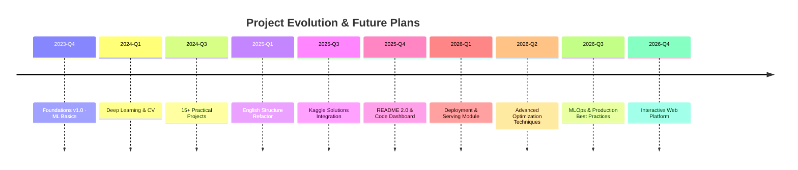

# AI-Practices Roadmap

This document outlines the planned features, improvements, and milestones for the AI-Practices project.

## 🎯 Vision

To build the most comprehensive, practical, and accessible Chinese-language AI learning resource that bridges theory and practice, serving students, researchers, and practitioners in their AI journey.

---

## 📅 Timeline Overview

---

## 🚀 Current Status (v2.0.0)

### ✅ Completed
- [x] 8 foundational ML chapters
- [x] Deep learning & neural networks module
- [x] Computer vision comprehensive coverage
- [x] Sequence models & NLP
- [x] 19 end-to-end practical projects
- [x] Kaggle competition solutions (4 competitions)
- [x] Quality audit system
- [x] English directory structure
- [x] GitHub automation (trends monitoring)
- [x] Comprehensive documentation
- [x] 113+ Jupyter notebooks
- [x] 149k+ lines of code

---

## 🔮 Short-term Goals (Q1-Q2 2026)

### 📚 Content Expansion

#### Theory Notes Completion
- [ ] **Optimizers Module** (`08-theory-notes/optimizers/`)
  - Complete optimizer comparison table (SGD, Adam, AdamW, RMSprop, etc.)
  - Add visualization of optimizer behavior
  - Include practical tuning guidelines
  - Estimated completion: 2026-Q1

#### Classic Architectures Enhancement
- [ ] **Training Logs & Performance Curves** (`03-computer-vision/02-classic-architectures/`)
  - Add detailed training logs for each architecture
  - Include performance comparison charts
  - Provide pre-trained model checkpoints
  - Estimated completion: 2026-Q1

#### Transformer Inference
- [ ] **Inference Scripts** (`04-sequence-models/05-sequence-to-sequence/`)
  - Add production-ready Transformer inference code
  - Include optimization techniques (quantization, pruning)
  - Provide deployment examples
  - Estimated completion: 2026-Q1

### 🏆 Kaggle Competition Updates
- [ ] **2024-2025 Latest Competitions** (`09-practical-projects/05_Kaggle竞赛项目/`)
  - Add 3-5 new competition solutions
  - Focus on: NLP, CV, Time Series, Tabular
  - Include detailed solution write-ups
  - Estimated completion: 2026-Q2

### 🌐 Internationalization
- [ ] **English Documentation**
  - Translate key theory notes to English
  - Create bilingual notebook versions
  - Improve international accessibility
  - Estimated completion: 2026-Q2

---

## 🎯 Mid-term Goals (Q3-Q4 2026)

### 🚢 Deployment & Serving Module (NEW)
- [ ] **Model Deployment** (`10-deployment-serving/`)
  - FastAPI model serving
  - Docker containerization
  - Kubernetes orchestration
  - Cloud deployment (AWS, GCP, Azure)
  - Edge deployment (TensorFlow Lite, ONNX)
  - Estimated completion: 2026-Q3

### ⚡ Advanced Optimization Techniques
- [ ] **Performance Optimization** (`05-advanced-topics/04-optimization/`)
  - Mixed precision training
  - Distributed training (DDP, Horovod)
  - Model quantization
  - Knowledge distillation
  - Neural Architecture Search (NAS)
  - Estimated completion: 2026-Q3

### 🔧 MLOps & Production Best Practices
- [ ] **MLOps Module** (`11-mlops/`)
  - Experiment tracking (MLflow, Weights & Biases)
  - Model versioning
  - CI/CD pipelines for ML
  - Monitoring & logging
  - A/B testing frameworks
  - Estimated completion: 2026-Q4

### 📊 Data Engineering
- [ ] **Data Pipeline Module** (`12-data-engineering/`)
  - ETL pipelines
  - Feature stores
  - Data validation
  - Data versioning (DVC)
  - Estimated completion: 2026-Q4

---

## 🌟 Long-term Vision (2027+)

### 🌐 Interactive Web Platform
- [ ] **Online Learning Platform**
  - Interactive Jupyter notebooks in browser
  - Progress tracking
  - Community forum
  - Code playground
  - Estimated start: 2027-Q1

### 🤖 Advanced AI Topics
- [ ] **Reinforcement Learning Module**
  - Q-Learning, DQN, PPO, A3C
  - OpenAI Gym integration
  - Real-world RL applications
  - Estimated start: 2027-Q2

- [ ] **Large Language Models (LLMs)**
  - Fine-tuning techniques (LoRA, QLoRA)
  - Prompt engineering
  - RAG (Retrieval-Augmented Generation)
  - LLM deployment
  - Estimated start: 2027-Q2

- [ ] **Multimodal AI**
  - Vision-Language models (CLIP, BLIP)
  - Audio processing
  - Video understanding
  - Estimated start: 2027-Q3

### 🏭 Industry Applications
- [ ] **Domain-Specific Modules**
  - Healthcare AI (medical imaging, diagnosis)
  - Finance AI (fraud detection, trading)
  - Autonomous vehicles
  - Robotics
  - Estimated start: 2027-Q3

### 📱 Mobile & Edge AI
- [ ] **Mobile Deployment**
  - TensorFlow Lite
  - Core ML (iOS)
  - Android ML Kit
  - On-device training
  - Estimated start: 2027-Q4

---

## 🛠️ Infrastructure Improvements

### Continuous Improvements
- [ ] **Documentation Website**
  - MkDocs or Docusaurus site
  - Searchable documentation
  - API reference
  - Target: 2026-Q2

- [ ] **Automated Testing**
  - Notebook execution tests
  - Code quality checks
  - Performance benchmarks
  - Target: 2026-Q2

- [ ] **GitHub Discussions**
  - Enable community discussions
  - Q&A section
  - Show and tell
  - Target: 2026-Q1

- [ ] **Video Tutorials**
  - YouTube channel
  - Bilibili channel (Chinese)
  - Course playlists
  - Target: 2026-Q3

---

## 📈 Growth Metrics & Goals

### Repository Goals
- **Stars**: 1,000+ by end of 2026
- **Forks**: 300+ by end of 2026
- **Contributors**: 20+ by end of 2026
- **Issues Resolved**: 90%+ resolution rate

### Content Goals
- **Notebooks**: 150+ by end of 2026
- **Projects**: 30+ by end of 2026
- **Documentation**: 50+ guides by end of 2026
- **Code Lines**: 200k+ by end of 2026

### Community Goals
- **Monthly Active Users**: 1,000+ by end of 2026
- **Discussion Participants**: 100+ by end of 2026
- **Blog Posts/Articles**: 20+ featuring AI-Practices

---

## 🤝 How to Contribute

We welcome contributions to help achieve these goals! Here's how you can help:

1. **Content Creation**
   - Write new tutorials or notebooks
   - Add practical projects
   - Translate documentation

2. **Code Improvements**
   - Fix bugs
   - Optimize performance
   - Add new features

3. **Documentation**
   - Improve existing docs
   - Add examples
   - Create video tutorials

4. **Community Building**
   - Answer questions in Issues/Discussions
   - Share your projects built with AI-Practices
   - Spread the word on social media

See [CONTRIBUTING.md](./CONTRIBUTING.md) for detailed guidelines.

---

## 📢 Feedback & Suggestions

Have ideas for the roadmap? We'd love to hear from you!

- **GitHub Issues**: [Open an issue](https://github.com/zimingttkx/AI-Practices/issues/new)
- **GitHub Discussions**: [Start a discussion](https://github.com/zimingttkx/AI-Practices/discussions)
- **Email**: Contact the maintainer

---

## 📝 Notes

- This roadmap is subject to change based on community feedback and priorities
- Dates are estimates and may shift based on complexity and resources
- We prioritize quality over speed - features will be released when ready
- Community contributions can accelerate timeline

---

**Last Updated**: 2025-11-30

**Version**: 2.0.0

**Maintained with ❤️ + curiosity**
