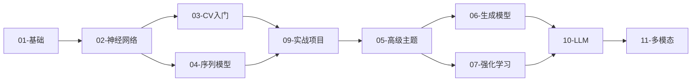

# AI-Practices 项目优化路线图

## 一、项目现状分析

### 已有优势

| 维度 | 现状 |
|:-----|:-----|
| **内容覆盖** | 9大模块、180+ notebooks、涵盖ML/DL/CV/NLP/RL |
| **工程规范** | 有CONTRIBUTING.md、CODEOWNERS、Issue模板、PR模板 |
| **CI/CD** | 已有validate-structure、deploy-docs、dependabot |
| **文档系统** | VitePress文档站、中英双语README |
| **测试覆盖** | 部分模块有测试(RL模块较完善，约20个测试文件) |
| **代码质量** | 已配置 pre-commit hooks (black, isort, ruff, nbqa) |

### 待改进领域

| 维度 | 问题 |
|:-----|:-----|
| **内容空白** | 缺少LLM/Diffusion/多模态；部分目录为空 |
| **测试覆盖** | 01-06模块几乎无测试 |
| **Docker** | 无容器化支持 |

---

## 二、已完成内容 (2024)

### Phase 1: Transformer 模块 ✅

#### 1.1 `04-sequence-models/05-transformer` 已完成

```
04-sequence-models/05-transformer/
├── 01-attention-mechanism/
│   ├── self_attention.ipynb         # 缩放点积注意力 + 方差证明
│   └── multi_head_attention.ipynb   # 多头注意力 + Flash Attention
├── 02-transformer-architecture/
│   ├── encoder.ipynb                # Pre-LN/Post-LN + GELU
│   ├── decoder.ipynb                # 解码器架构
│   └── positional_encoding.ipynb    # 位置编码 (RoPE, ALiBi)
└── 03-bert-gpt-basics/
    └── gpt_from_scratch.ipynb       # GPT从零实现 + KV Cache
```

**特性**:
- 缩放点积注意力的数学证明 (方差为 d_k)
- Pre-LN/Post-LN 架构切换
- GELU 激活函数实现
- 因果掩码可视化
- KV Cache 推理加速
- Nucleus Sampling 采样策略

### Phase 2: 生成式模型 ✅

#### 2.1 `06-generative-models/01-vae` 已完成

```
06-generative-models/01-vae/
└── variational_ae.ipynb             # VAE + ELBO推导 + KL散度解析解
```

**特性**:
- ELBO (Evidence Lower Bound) 完整推导
- KL 散度解析解证明
- 重参数化技巧
- β-VAE 变体
- CNN-VAE 卷积架构
- VQ-VAE 离散码本
- 潜在空间流形可视化

#### 2.2 `06-generative-models/03-diffusion` 已完成

```
06-generative-models/03-diffusion/
├── ddpm_basics.ipynb                # DDPM基础 + 物理直觉 + SNR分析
└── ddpm_implementation.ipynb        # 完整实现
```

**特性**:
- 非平衡热力学扩散过程类比
- Fokker-Planck 方程解释
- Closed-form 前向过程推导
- 信噪比 (SNR) 可视化
- 简化 U-Net 噪声预测
- DDIM 加速采样
- Classifier-Free Guidance (CFG)

---

## 三、待补充内容

### Phase 3: 填补空白模块

#### 3.1 补充 `06-generative-models` 剩余内容

```
06-generative-models/
├── 01-vae/
│   ├── README.md                    # ✅ 已完成 (模块知识点)
│   ├── vanilla_ae.ipynb             # ✅ 已完成 (信息瓶颈、PCA关系)
│   ├── variational_ae.ipynb         # ✅ 已完成 (ELBO推导)
│   └── vq_vae.ipynb                 # ✅ 已完成 (离散码本、直通估计器)
├── 02-gans/
│   ├── README.md                    # ✅ 已有
│   ├── gan_basics.ipynb             # ✅ 已完成 (Nash均衡、Minimax)
│   ├── dcgan.ipynb                  # ✅ 已完成 (转置卷积、架构设计)
│   ├── wgan_gp.ipynb                # ✅ 已完成 (Wasserstein距离、GP)
│   └── GAN网络实现.ipynb            # ✅ 已有
├── 03-diffusion-models/
│   ├── ddpm_basics.ipynb            # ✅ 已完成
│   ├── ddpm_implementation.ipynb    # ✅ 已完成
│   └── stable_diffusion_intro.ipynb # Stable Diffusion入门
├── 04-text-generation/
│   └── char_rnn.ipynb               # 字符级RNN文本生成
├── 05-deepdream/
│   └── deepdream.ipynb              # DeepDream风格迁移
└── 06-neural-style-transfer/
    └── neural_style_transfer.ipynb  # 神经风格迁移
```

#### 3.2 补充 `05-advanced-topics/03-model-optimization` ✅ 已完成 (2026-01-02)

```
05-advanced-topics/03-model-optimization/
├── 01-quantization/
│   ├── README.md                           # ✅ 已完成
│   └── notebooks/
│       ├── quantization_fundamentals.ipynb # ✅ 已完成 (SOTA标准)
│       ├── post_training_quantization.ipynb # ✅ 已完成
│       └── quantization_aware_training.ipynb # ✅ 已完成
├── 02-pruning/
│   ├── README.md                           # ✅ 已完成
│   └── notebooks/
│       ├── pruning_fundamentals.ipynb      # ✅ 已完成
│       ├── structured_pruning.ipynb        # ✅ 已完成
│       └── lottery_ticket_hypothesis.ipynb # ✅ 已完成
├── 03-knowledge-distillation/
│   ├── README.md                           # ✅ 已完成
│   └── notebooks/
│       ├── distillation_basics.ipynb       # ✅ 已完成
│       ├── feature_distillation.ipynb      # ✅ 已完成
│       └── self_distillation.ipynb         # ✅ 已完成
└── 04-deployment/
    ├── README.md                           # ✅ 已完成
    └── notebooks/
        ├── onnx_export.ipynb               # ✅ 已完成
        ├── tensorrt_optimization.ipynb     # ✅ 已完成
        └── torchscript_deployment.ipynb    # ✅ 已完成
```

---

## 四、实施时间表 (更新于 2026-01-02)

| 阶段 | 内容 | 时间 | 状态 |
|:----:|:-----|:----:|:------:|
| Week 1-2 | 补充04-sequence-models/05-transformer | 2周 | ✅ 已完成 |
| Week 2-3 | 补充06-generative-models (VAE/GAN/Diffusion) | 2周 | ✅ 已完成 |
| Week 3-4 | 补充05-advanced-topics/03-model-optimization | 1周 | ✅ 已完成 |
| Week 4-6 | 新增10-large-language-models (01-03子模块) | 2周 | ✅ 已完成 |
| Week 6-8 | 新增10-large-language-models (04-07子模块) | 2周 | 🔲 待开发 |
| Week 8-10 | 新增11-multimodal-learning模块 | 2周 | 🔲 待开发 |
| Week 10+ | 工程化: Docker + 测试覆盖 | 持续 | 🔲 待开发 |

### 下次开发重点 (10-large-language-models)

1. **04-prompt-engineering**: 提示工程基础、Few-shot、CoT
2. **05-rag**: 向量数据库、RAG流水线
3. **06-agents**: LangChain、工具调用
4. **07-alignment**: RLHF、DPO

```
10-large-language-models/
├── README.md                        # ✅ 已完成
├── 01-llm-fundamentals/
│   ├── README.md                    # ✅ 已完成
│   ├── knowledge_points.md          # ✅ 已完成 (606行，Transformer详解)
│   ├── src/
│   │   └── transformer_architecture_v2.py  # ✅ 已完成
│   └── notebooks/
│       ├── transformer_architecture.ipynb  # ✅ 已完成
│       └── tokenizer_architecture.ipynb    # ✅ 已完成
│
├── 02-pretrained-models/
│   ├── README.md                    # ✅ 已完成
│   ├── knowledge_points.md          # ✅ 已完成 (GPT/BERT/LLaMA/缩放定律)
│   ├── src/
│   │   ├── __init__.py              # ✅ 已完成
│   │   ├── gpt_model.py             # ✅ 已完成 (362行，完整GPT实现)
│   │   └── llama_model.py           # ✅ 已完成 (389行，RMSNorm/RoPE/SwiGLU/GQA)
│   └── notebooks/
│       ├── gpt_architecture.ipynb   # ✅ 已完成 (SOTA标准)
│       └── llama_architecture.ipynb # ✅ 已完成 (SOTA标准)
│
├── 03-fine-tuning/
│   ├── README.md                    # ✅ 已完成
│   ├── knowledge_points.md          # ✅ 已完成 (LoRA/QLoRA/PEFT)
│   ├── src/
│   │   ├── __init__.py              # ✅ 已完成
│   │   ├── lora.py                  # ✅ 已完成 (285行，完整LoRA实现)
│   │   └── trainer.py               # ✅ 已完成 (304行，微调训练器)
│   └── notebooks/
│       └── lora_finetuning.ipynb    # ✅ 已完成 (SOTA标准)
│
├── 04-prompt-engineering/           # 🔲 待开发
│   ├── prompt_basics.ipynb
│   ├── few_shot_learning.ipynb
│   ├── chain_of_thought.ipynb
│   └── prompt_optimization.ipynb
│
├── 05-rag/                          # 🔲 待开发
│   ├── vector_databases.ipynb
│   ├── embedding_models.ipynb
│   ├── rag_pipeline.ipynb
│   └── advanced_rag.ipynb
│
├── 06-agents/                       # 🔲 待开发
│   ├── langchain_basics.ipynb
│   ├── llamaindex_basics.ipynb
│   ├── tool_use.ipynb
│   └── multi_agent.ipynb
│
└── 07-alignment/                    # 🔲 待开发
    ├── rlhf_basics.ipynb
    ├── dpo_training.ipynb
    └── constitutional_ai.ipynb
```

**LLM模块已完成统计 (2026-01-02)**:
- Python源码: 1,340+ 行
- 知识点文档: 1,229 行
- Notebook: 5个 (SOTA标准)
- 完成度: 01-03子模块 100%，总体约 40%

---

### Phase 3: 多模态学习 (4-6周)

```
11-multimodal-learning/
├── README.md
├── 01-vision-language/
│   ├── clip_basics.ipynb
│   ├── blip_image_captioning.ipynb
│   └── llava_multimodal.ipynb
│
├── 02-image-generation/
│   ├── stable_diffusion_pipeline.ipynb
│   ├── controlnet.ipynb
│   └── image_editing.ipynb
│
└── 03-audio-models/
    ├── whisper_transcription.ipynb
    └── tts_basics.ipynb
```

---

## 三、工程化提升方案

### 3.1 代码质量工具链

**pyproject.toml 配置**:

```toml
[tool.black]
line-length = 100
target-version = ['py310']
include = '\.pyi?$'
exclude = '''
/(
    \.git
    | \.venv
    | node_modules
    | __pycache__
)/
'''

[tool.isort]
profile = "black"
line_length = 100
skip = [".git", "node_modules", "__pycache__"]

[tool.ruff]
line-length = 100
select = ["E", "F", "W", "I", "N", "D", "UP", "B", "C4"]
ignore = ["D100", "D104"]
exclude = ["node_modules", ".git", "__pycache__"]

[tool.mypy]
python_version = "3.10"
warn_return_any = true
warn_unused_ignores = true
ignore_missing_imports = true
```

**pre-commit 配置**:

```yaml
repos:
  - repo: https://github.com/pre-commit/pre-commit-hooks
    rev: v4.5.0
    hooks:
      - id: trailing-whitespace
      - id: end-of-file-fixer
      - id: check-yaml
      - id: check-added-large-files
        args: ['--maxkb=5000']
      - id: detect-private-key

  - repo: https://github.com/psf/black
    rev: 23.12.1
    hooks:
      - id: black

  - repo: https://github.com/pycqa/isort
    rev: 5.13.2
    hooks:
      - id: isort

  - repo: https://github.com/astral-sh/ruff-pre-commit
    rev: v0.1.9
    hooks:
      - id: ruff
        args: [--fix]

  - repo: https://github.com/nbQA-dev/nbQA
    rev: 1.7.1
    hooks:
      - id: nbqa-black
      - id: nbqa-isort
```

### 3.2 测试框架完善

**pytest.ini 配置**:

```ini
[pytest]
testpaths = tests
python_files = test_*.py
python_classes = Test*
python_functions = test_*
addopts = -v --tb=short --strict-markers
markers =
    slow: marks tests as slow
    gpu: marks tests requiring GPU
```

**测试目录结构**:

```
tests/
├── conftest.py
├── test_foundations/
│   ├── test_linear_models.py
│   └── test_ensemble.py
├── test_neural_networks/
│   └── test_keras_models.py
├── test_computer_vision/
│   └── test_cnn.py
├── test_sequence_models/
│   └── test_rnn.py
└── test_utils/
    └── test_common.py
```

### 3.3 CI/CD 增强

**test.yml 工作流**:

```yaml
name: Tests

on:
  push:
    branches: [main, develop]
  pull_request:
    branches: [main]

jobs:
  test:
    runs-on: ubuntu-latest
    strategy:
      matrix:
        python-version: ['3.10', '3.11']

    steps:
      - uses: actions/checkout@v4

      - name: Set up Python
        uses: actions/setup-python@v5
        with:
          python-version: ${{ matrix.python-version }}
          cache: 'pip'

      - name: Install dependencies
        run: |
          pip install -r requirements.txt
          pip install pytest pytest-cov nbval

      - name: Run unit tests
        run: pytest tests/ -v --cov=utils --cov-report=xml

      - name: Validate notebooks (smoke test)
        run: |
          pytest --nbval-lax \
            01-foundations/01-training-models/01-LinearRegression.ipynb \
            --ignore=node_modules

      - name: Upload coverage
        uses: codecov/codecov-action@v3
        with:
          file: ./coverage.xml
```

### 3.4 Docker 支持

**Dockerfile**:

```dockerfile
FROM python:3.10-slim

WORKDIR /app

RUN apt-get update && apt-get install -y \
    git \
    libgl1-mesa-glx \
    libglib2.0-0 \
    && rm -rf /var/lib/apt/lists/*

COPY requirements.txt .
RUN pip install --no-cache-dir -r requirements.txt
RUN pip install jupyterlab

EXPOSE 8888

CMD ["jupyter", "lab", "--ip=0.0.0.0", "--port=8888", "--no-browser", "--allow-root"]
```

**docker-compose.yml**:

```yaml
version: '3.8'

services:
  jupyter:
    build: .
    ports:
      - "8888:8888"
    volumes:
      - .:/app
    environment:
      - JUPYTER_TOKEN=ai-practices

  jupyter-gpu:
    build: .
    runtime: nvidia
    ports:
      - "8889:8888"
    volumes:
      - .:/app
    environment:
      - JUPYTER_TOKEN=ai-practices
    deploy:
      resources:
        reservations:
          devices:
            - driver: nvidia
              count: 1
              capabilities: [gpu]
```

---

## 四、用户体验优化方案

### 4.1 学习路径可视化



### 4.2 难度标签系统

为每个notebook添加元数据:

```python
"""
---
title: 线性回归
difficulty: beginner  # beginner/intermediate/advanced
estimated_time: 30min
prerequisites: [numpy, matplotlib]
colab_link: https://colab.research.google.com/...
---
"""
```

### 4.3 一键运行按钮

各模块README添加Colab/Binder按钮:

```markdown
[](https://colab.research.google.com/github/zimingttkx/AI-Practices/blob/main/...)

[](https://mybinder.org/v2/gh/zimingttkx/AI-Practices/main)
```

---

## 五、新增依赖

```txt
# LLM相关
transformers>=4.36.0
peft>=0.7.0
bitsandbytes>=0.41.0
accelerate>=0.25.0
datasets>=2.15.0
sentencepiece>=0.1.99
tiktoken>=0.5.0
einops>=0.7.0

# RAG相关
langchain>=0.1.0
langchain-community>=0.0.10
llama-index>=0.9.0
chromadb>=0.4.0
faiss-cpu>=1.7.4

# 向量嵌入
sentence-transformers>=2.2.0

# Diffusion
diffusers>=0.25.0

# 多模态
open-clip-torch>=2.24.0

# 开发工具
pytest>=7.4.0
pytest-cov>=4.1.0
nbval>=0.10.0
black>=23.12.0
isort>=5.13.0
ruff>=0.1.9
pre-commit>=3.6.0
nbqa>=1.7.0
```

---

## 六、文件变更清单

### 新增文件

```
├── pyproject.toml
├── .pre-commit-config.yaml
├── pytest.ini
├── Dockerfile
├── docker-compose.yml
├── LEARNING_CHECKLIST.md
├── tests/
│   ├── conftest.py
│   └── ...
├── 04-sequence-models/05-transformer/
├── 06-generative-models/01-autoencoders/
├── 06-generative-models/03-diffusion-models/
├── 05-advanced-topics/03-model-optimization/01-quantization/
├── 10-large-language-models/
└── 11-multimodal-learning/
```

### 修改文件

```
├── requirements.txt
├── environment.yml
├── README.md
├── .github/workflows/
└── docs/
```
